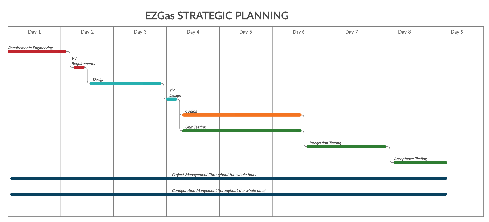

# Project Estimation  

Authors: Giuliano Ettore, Koudounas Alkis, Pizzato Francesco

Date: 30/06/2020

Version: 2.0

# Contents

- [Estimate by product decomposition](#estimate-by-product-decomposition)
- [Estimate by activity decomposition](#estimate-by-activity-decomposition)
- [Gantt Chart](#gantt-chart)

# Estimation approach

<Consider the EZGas  project as described in YOUR requirement document, assume that you are going to develop the project INDEPENDENT of the deadlines of the course>

# Estimate by product decomposition

### 

|                                                                                                         | Estimate           |             
| ------------------------------------------------------------------------------------------------------- | -----------------  |  
| NC = Estimated number of classes to be developed                                                        |  20                |             
| A = Estimated average size per class, in LOC                                                            |  120               | 
| S = Estimated size of project, in LOC (= NC * A)                                                        |  2400              |
| E = Estimated effort, in person hours (here use productivity 10 LOC per person hour)                    |  289.1             |   
| C = Estimated cost, in euro (here use 1 person hour cost = 30 euro)                                     |  8673              | 
| Estimated calendar time, in calendar weeks (Assume team of 4 people, 8 hours per day, 5 days per week ) |  ~2                |            

# Estimate by activity decomposition

### 

|         Activity name               | Estimated effort (person hours) |             
| ----------------------------------- | ------------------------------- | 
| Requirements engineering            |        35                       |
| VV Requirements                     |        6                        |
| Design                              |        40                       |
| VV Design                           |        10                       |
| Coding                              |        70                       |
| Unit Testing                        |        32                       |
| Integration Testing                 |        42                       |
| Acceptance Testing                  |        20                       |
| Project Management                  |        8                        |
| Configuration Management            |        15                       |

### Gantt Chart

