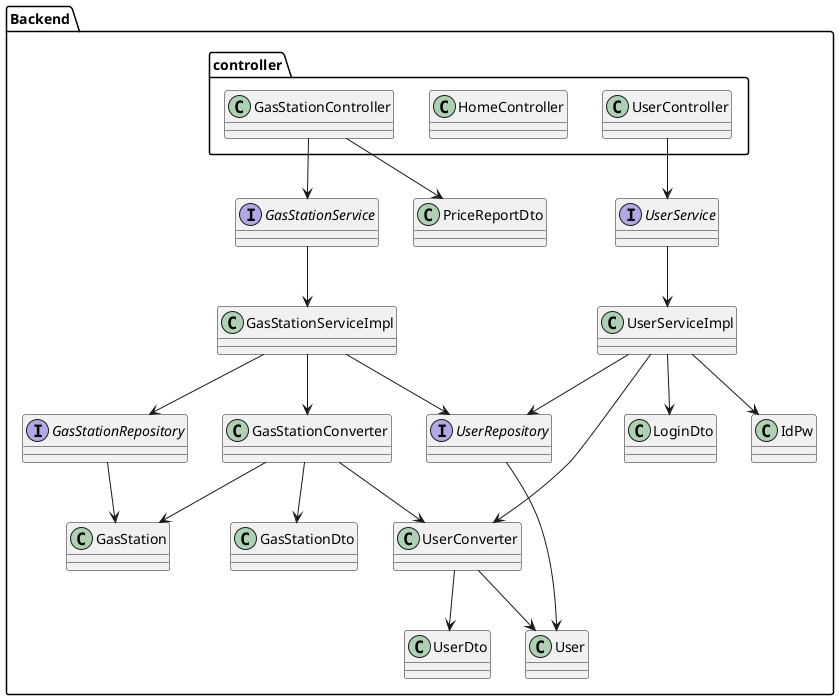
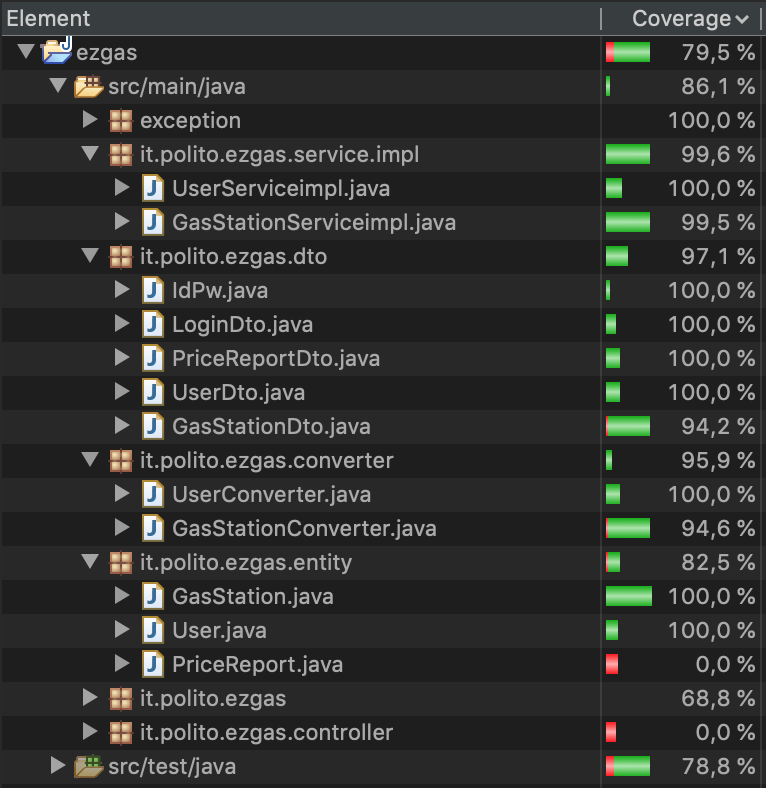
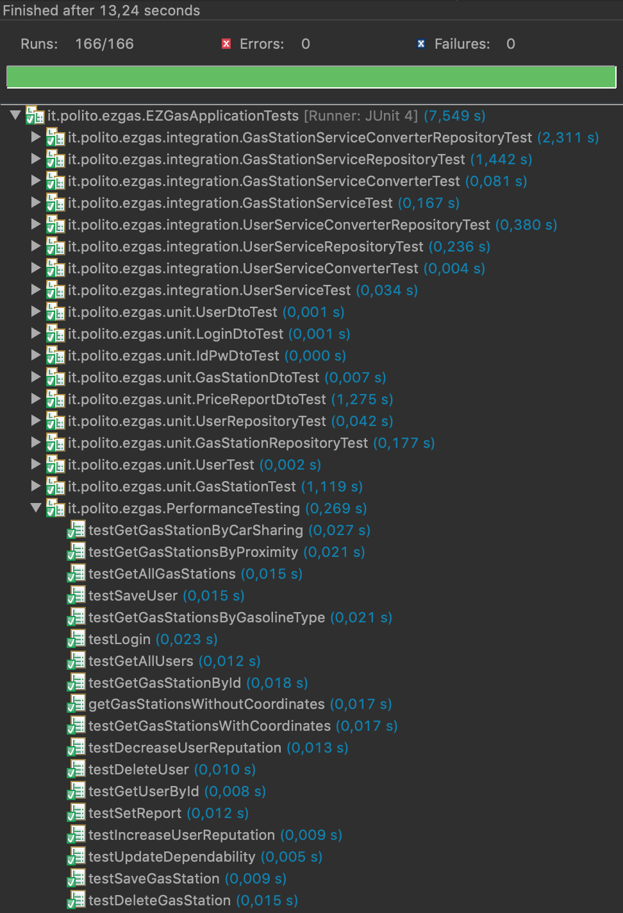

# Integration and API Test Documentation

Authors: Giuliano Ettore, Koudounas Alkis, Pizzato Francesco

Date: 14/06/2020

Version: 2.0

List of changes 

|         |                                      |
|---------|------------------------------------- |
| CR4     | Add scenarios                        |
| APIv2   | Update coverage screenshot           | 
|	      | Updated Eclemma coverage screenshot  |

# Contents

- [Dependency graph](#dependency-graph)

- [Integration approach](#integration-approach)

- [Tests](#tests)

- [Scenarios](#scenarios)

- [Coverage of scenarios and FR](#coverage-of-scenarios-and-fr)
- [Coverage of non-functional requirements](#coverage-of-non-functional-requirements)

# Dependency graph 

<!-- <report the here the dependency graph of the classes in it/polito/Ezgas, using plantuml> -->

     
# Integration approach

<!-- >    <Write here the integration sequence you adopted, in general terms (top down, bottom up, mixed) and as sequence
    (ex: step1: class A, step 2: class A+B, step 3: class A+B+C, etc)> 
    <The last integration step corresponds to API testing at level of Service package>
    <Tests at level of Controller package will be done later> -->

The approach we used in the integration testing is the top down strategy.
The steps are the following:
- step 1: class Serviceimpl (both Converter and Repository stubs)
- step 2: class Serviceimpl + class Converter (Repository stub)
- step 3: class Serviceimpl + class Repository (Converter stub)
- step 4: class Serviceimpl + class Converter + class Repository 

We applied these steps first to the User model, and then to the Gas Station one (which depends on UserConverter and UserRepository).

#  Tests

<!--   <define below a table for each integration step. For each integration step report the group of classes under test, and the names of
     JUnit test cases applied to them> -->

## Step 1

| Classes               | JUnit test cases              |
|-----------------------|-------------------------------|
| UserServiceimpl       | All test cases of `UserServiceTest class`       |
| GasStationServiceimpl | All test cases of `GasStationServiceTest class` |

## Step 2

| Classes                                    | JUnit test cases                        |
|--------------------------------------------|-----------------------------------------|
| UserServiceimpl, UserConverter             | All test cases of `UserServiceConverterTest class`        |
| GasStationServiceimpl, GasStationConverter | All test cases of `GasStationServiceConverterTest class`  |

## Step 3

| Classes                                    | JUnit test cases                        |
|--------------------------------------------|-----------------------------------------|
| UserServiceimpl, UserRepository            | All test cases of `UserServiceRepositoryTest class`       |
| GasStationServiceimpl, GasStationRepository| All test cases of `GasStationServiceRepositoryTest class` |

## Step 4 API Tests

<!--   <The last integration step  should correspond to API testing, or tests applied to all classes implementing the APIs defined in the Service package> -->

| Classes                                                          | JUnit test cases                                 |
|------------------------------------------------------------------|--------------------------------------------------|
| UserServiceimpl, UserConverter, UserRepository                   | All test cases of `UserServiceConverterRepositoryTest class`       |
| GasStationServiceimpl, GasStationConverter, GasStationRepository | All test cases of `GasStationServiceConverterRepositoryTest class` |

In the following screenshot, we report the coverage of the application after both the integration and the unit testing.

# Scenarios

<!--<If needed, define here additional scenarios for the application. Scenarios should be named
 referring the UC they detail>-->

## Scenario UC4.1

| Scenario |  invalid coordinates |
| ------------- |:-------------:| 
|  Precondition     | Gas Station  G does not exist                                                       |
|  Post condition   | Gas Station G is not created                                                        |
| Step#        | Description                                                                              |
|  1           | The administrator wants to create a new gas station                                      |  
|  2           | The administrator enters all the fields and an incorrect value for latitude or longitude |
|  3           | The system launches a "GPSDataException" and the gas station is not created              |

## Scenario UC7.1

| Scenario |  invalid price |
| ------------- |:-------------:| 
|  Precondition     | Gas station G exists |
|                   | User U is registered in the system |
|                   | G has no attached price list |
|  Post condition     | G.time_tag is set to the current timestamp of the system |
|                     | U is attached to G |
| Step#        | Description  |
|  1     | The user U selects a gas station G for which he/she wants to insert a price report |  
|  2     | The system prompts the user with the list of possible fuels provided by the gas station|
|  3     | The user inserts the prices for the fuels but some of them are negative|
|  4     | The system launches a "PriceException" and the prices for that gas station are not modified|

## Scenario UC7.2

| Scenario |  invalid price |
| ------------- |:-------------:| 
|  Precondition     | Gas station G exists |
|                   | User U is registered in the system |
|                   | G has already an attached price list made by U2 |
|                   | U.trust_level >= U2.trust_level |
|                   | (today - G.time_tag) <= 4 |
|  Post condition     | G.time_tag is set to the current timestamp of the system |
|                     | U is attached to G |
| Step#        | Description  |
|  1     | The user U selects a gas station G for which he/she wants to insert a price report |  
|  2     | The system prompts the user with the list of possible fuels provided by the gas station|
|  3     | The user inserts the prices for the fuels |
|  4     | The previous price list is overwritten |

## Scenario UC7.3

| Scenario |  invalid price |
| ------------- |:-------------:| 
|  Precondition     | Gas station G exists |
|                   | User U is registered in the system |
|                   | G has already an attached price list made by U2 |
|                   | U.trust_level < U2.trust_level |
|                   | (today - G.time_tag) <= 4 |
|  Post condition     | G.time_tag is set to the current timestamp of the system |
|                     | U is attached to G |
| Step#        | Description  |
|  1     | The user U selects a gas station G for which he/she wants to insert a price report |  
|  2     | The system prompts the user with the list of possible fuels provided by the gas station|
|  3     | The user inserts the prices for the fuels |
|  4     | The previous price list is not overwritten since U has a lower reputation than U2 |

## Scenario UC7.4

| Scenario |  invalid price |
| ------------- |:-------------:| 
|  Precondition     | Gas station G exists |
|                   | User U is registered in the system |
|                   | G has already an attached price list made by U2 |
|                   | U.trust_level < U2.trust_level |
|                   | (today - G.time_tag) > 4 |
|  Post condition     | G.time_tag is set to the current timestamp of the system |
|                     | U is attached to G |
| Step#        | Description  |
|  1     | The user U selects a gas station G for which he/she wants to insert a price report |  
|  2     | The system prompts the user with the list of possible fuels provided by the gas station|
|  3     | The user inserts the prices for the fuels |
|  4     | The previous price list is overwritten since the previous one was inserted more than 4 days earlier  |

## Scenario UC8.1

| Scenario |  Obtain fuel prices in a certain geographic area |
| ------------- |:-------------:| 
|  Precondition   | -  |
|  Post condition | -  |
| Step#           | Description  |
|  1     | The anonymous user AU selects an address and an optional value in km for the radius  |  
|  2     | The system prompts all gas stations within the specified distance from that location |
|  3     | The system also shows, for each gas station, the trust level of the prices |
## Scenario UC8.2

| Scenario |  Obtain fuel prices in a certain geographic area filtered by car sharing |
| ------------- |:-------------:| 
|  Precondition     | - |
|  Post condition     | -  |
| Step#        | Description  |
|  1     | The anonymous user AU selects an address and an optional value in km for the radius |
|  2     | The anonymous user can restrict the research to a certain car sharing |  
|  3     | The system prompts all matching gas stations within the specified distance from that location |
|  4     | The system also shows, for each gas station, the trust level of the prices |

## Scenario UC8.3

| Scenario |  Obtain fuel prices in a certain geographic area filtered by fuel type |
| ------------- |:-------------:| 
|  Precondition     | - |
|  Post condition     | -  |
| Step#        | Description  |
|  1     | The anonymous user AU selects an address and an optional value in km for the radius |
|  2     | The anonymous user can restrict the research to a certain fuel type |  
|  3     | The system prompts all matching gas stations within the specified distance from that location |
|  4     | The system also shows, for each gas station, the trust level of the prices |

## Scenario UC8.4

| Scenario |  Obtain fuel prices in a certain geographic area filtered by fuel type and car sharing |
| ------------- |:-------------:| 
|  Precondition     | - |
|  Post condition     | -  |
| Step#        | Description  |
|  1     | The anonymous user AU selects an address and an optional value in km for the radius |
|  2     | The anonymous user can restrict the research to a certain car sharing and fuel type |  
|  3     | The system prompts all matching gas stations within the specified distance from that location |
|  4     | The system also shows, for each gas station, the trust level of the prices 

# Coverage of Scenarios and FR

<!--<Report in the following table the coverage of  scenarios (from official requirements and from above) vs FR. 
Report also for each of the scenarios the (one or more) API JUnit tests that cover it. >-->

| Scenario ID | Functional Requirements covered | JUnit  Test(s) | 
| --------------------------------------------------------------------------------------------- | ----------------------------- | ----------- | 
| UC1 - Create user account                                                                     | FR1.1                         | _`UserServiceConverterRepositoryTest.testSaveUser()`_|
| UC2.1 - User modify his/her account                                                           | FR1.1, FR2                    | _`UserServiceConverterRepositoryTest.testSaveUser()`_|
|                                                                                               |                               | _`UserServiceConverterRepositoryTest.testLogin()`_|
| UC2.2 - Admin modify user account                                                             | FR1.1, FR1.3, FR2             | _`UserServiceConverterRepositoryTest.testSaveUser()`_|
|                                                                                               |                               | _`UserServiceConverterRepositoryTest.testGetAllUsers()`_|
|                                                                                               |                               | _`UserServiceConverterRepositoryTest.testLogin()`_|
| UC3 - Delete user account                                                                     | FR1.2, FR2                    | _`UserServiceConverterRepositoryTest.testDeleteUser()`_|
|                                                                                               |                               | _`UserServiceConverterRepositoryTest.testLogin()`_|
| UC4 - Create Gas Station                                                                      | FR3.1, FR2                    | _`GasStationServiceConverterRepositoryTest.testSaveGasStation()`_|
|                                                                                               |                               | _`UserServiceConverterRepositoryTest.testLogin()`_|
| UC4.1 - Create Gas Station with invalid coordinates                                           | FR3.1, FR2                    | _`GasStationServiceConverterRepositoryTest.testSaveGasStation()`_|
|                                                                                               |                               | _`UserServiceConverterRepositoryTest.testLogin()`_|
| UC5 - Modify Gas Station information                                                          | FR3.1, FR2, FR3.3             | _`GasStationServiceConverterRepositoryTest.testSaveGasStation()`_|
|                                                                                               |                               | _`UserServiceConverterRepositoryTest.testLogin()`_|
|                                                                                               |                               | _`GasStationServiceConverterRepositoryTest.testGetAllGasStations()`_|
| UC6 - Delete Gas Station                                                                      | FR3.2, FR2                    | _`GasStationServiceConverterRepositoryTest.testDeleteGasStation()`_|
|                                                                                               |                               | _`UserServiceConverterRepositoryTest.testLogin()`_|
| UC7 - Report fuel price for a gas station                                                     | FR5.1, FR1.4, FR2             | _`GasStationServiceConverterRepositoryTest.testSetReport()`_|
|                                                                                               |                               | _`UserServiceConverterRepositoryTest.testGetUserById()`_|
|                                                                                               |                               | _`UserServiceConverterRepositoryTest.testLogin()`_|
| UC7.1 - Report invalid fuel price for a gas station                                           | FR5.1, FR1.4, FR2             | _`GasStationServiceConverterRepositoryTest.testSetReport()`_|
|                                                                                               |                               | _`UserServiceConverterRepositoryTest.testGetUserById()`_|
|                                                                                               |                               | _`UserServiceConverterRepositoryTest.testLogin()`_|
| UC7.2 - Report invalid fuel price for a gas station                                           | FR5.1, FR1.4, FR2             | _`GasStationServiceConverterRepositoryTest.testSetReport()`_|
|                                                                                               |                               | _`UserServiceConverterRepositoryTest.testGetUserById()`_|
|                                                                                               |                               | _`UserServiceConverterRepositoryTest.testLogin()`_|
| UC7.3 - Report invalid fuel price for a gas station                                           | FR5.1, FR1.4, FR2             | _`GasStationServiceConverterRepositoryTest.testSetReport()`_|
|                                                                                               |                               | _`UserServiceConverterRepositoryTest.testGetUserById()`_|
|                                                                                               |                               | _`UserServiceConverterRepositoryTest.testLogin()`_|
| UC7.4 - Report invalid fuel price for a gas station                                           | FR5.1, FR1.4, FR2             | _`GasStationServiceConverterRepositoryTest.testSetReport()`_|
|                                                                                               |                               | _`UserServiceConverterRepositoryTest.testGetUserById()`_|
|                                                                                               |                               | _`UserServiceConverterRepositoryTest.testLogin()`_|
| UC8.1 - Obtain fuel prices in a certain geographic area                                       | FR4.1, FR4.2, FR4.3, FR4.4    | _`GasStationServiceConverterRepositoryTest.testGetGasStationsByProximity()`_|
| UC8.2 - Obtain fuel prices in a certain geographic area filtered by car sharing               | FR4.1, FR4.2, FR4.3, FR4.4, FR4.5 | _`GasStationServiceConverterRepositoryTest.testGetGasStationsByProximity()`_|
|                                                                                               |                               | _`GasStationServiceConverterRepositoryTest.testGetGasStationByCarSharing()`_|
| UC8.3 - Obtain fuel prices in a certain geographic area filtered by fuel type                 | FR4.1, FR4.2, FR4.3, FR4.4, FR4.5 | _`GasStationServiceConverterRepositoryTest.testGetGasStationsByProximity()`_|
|                                                                                               |                               | _`GasStationServiceConverterRepositoryTest.testGetGasStationsByGasolineType()`_|
| UC8.4 - Obtain fuel prices in a certain geographic area filtered by fuel type and car sharing | FR4.1, FR4.2, FR4.3, FR4.4, FR4.5 | _`GasStationServiceConverterRepositoryTest.testGetGasStationsWithCoordinates()`_|
| UC9 - Update trust level of price list                                                        | FR5.2                         | _`GasStationServiceConverterRepositoryTest.testUpdateDependability()`_|
| UC10.1 - Evaluate correct price                                                               | FR5.3, FR1.4, FR2             | _`UserServiceConverterRepositoryTest.testIncreaseUserReputation()`_|
|                                                                                               |                               | _`UserServiceConverterRepositoryTest.testGetUserById()`_|
|                                                                                               |                               | _`UserServiceConverterRepositoryTest.testLogin()`_|
| UC10.2 - Evaluate wrong price                                                                 | FR5.3, FR1.4, FR2             | _`UserServiceConverterRepositoryTest.testDecreaseUserReputation()`_|
|                                                                                               |                               | _`UserServiceConverterRepositoryTest.testGetUserById()`_|
|                                                                                               |                               | _`UserServiceConverterRepositoryTest.testLogin()`_|           

# Coverage of Non Functional Requirements

<!-- <Report in the following table the coverage of the Non Functional Requirements of the application - only those that can be tested with automated testing frameworks.> -->

### 

| Non Functional Requirement | Test name                    |
| -------------------------- | ---------------------------- |
|    NFR2 - Performance      | _`PerformanceTesting class`_ |

To test this NFR, we created a new JUnit class that uses the Timeout attribute of the @Test annotation. Looking at the following screenshot, it is clear that all tests (in the Performance Testing class) run within 500 ms.

