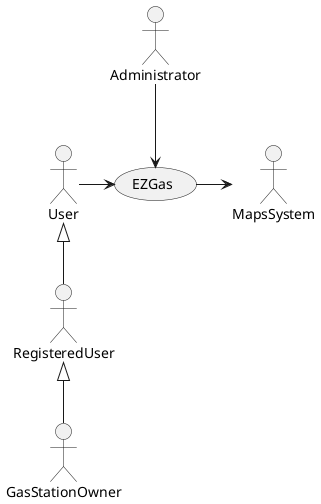
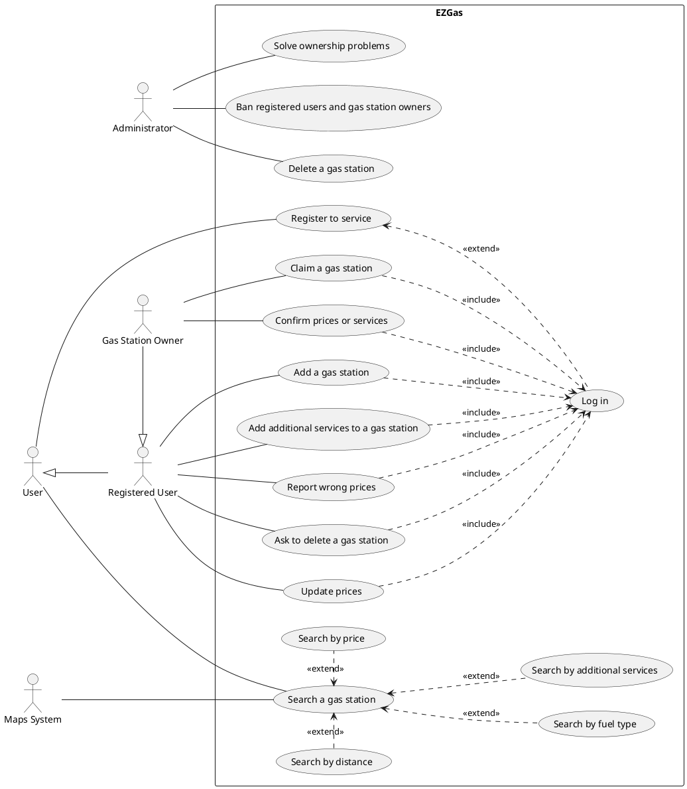
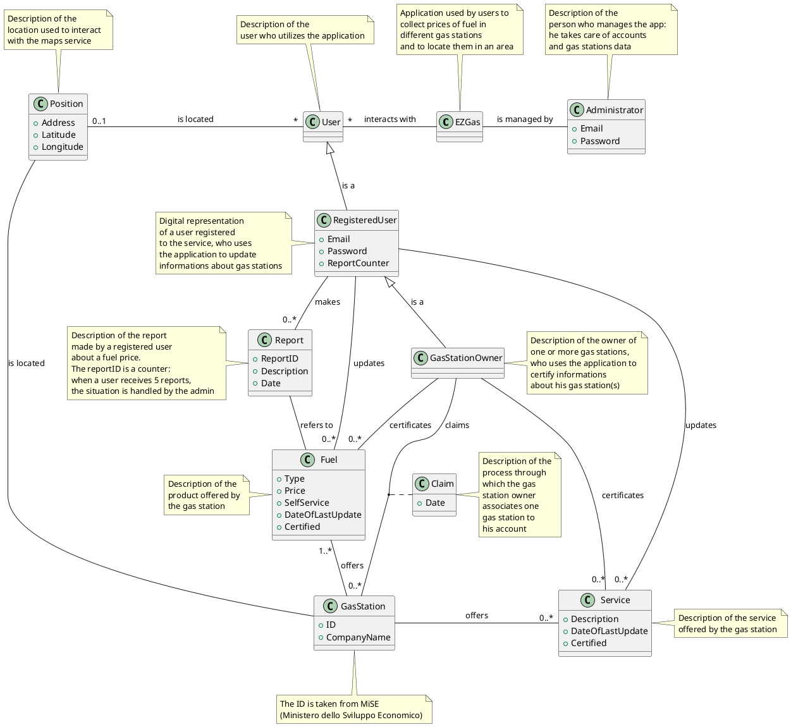
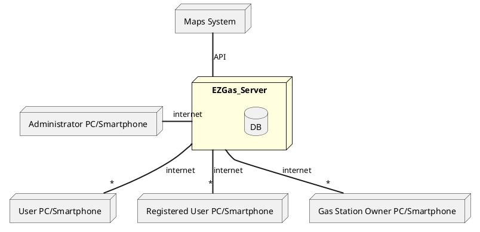

# Requirements Document 

Authors: Feihong Shi, Giuliano Ettore, Koudounas Alkis, Pizzato Francesco 

Date: 10/04/2020

Version:

| Version   | Changes                                     |
| ----------|:--------------------------------------------|
| 2         | Added stories and personas                  |
|           | Added FR and NFR                            |
| 3         | Minor fixes to FR                           |
|           | Added use cases and scenarios               |
|           | Added glossary                              |
| 4         | Minor fixes to glossary                     |
|           | Added UC diagram                            |
|           | Minor fixes to use cases                    |
|           | Minor fixes due to verification process     |
|           | Added deployment diagram                    |
| 5         | Minor fixes to glossary                     |
|           | Minor fixes to deployment diagram           |
| 6         | Added NFRs                                  |
|           | Minor fixes to FRs                          |
|           | Minor fixes to context diagram              |

# Contents

- [Stakeholders](#stakeholders)
- [Context Diagram and interfaces](#context-diagram-and-interfaces)
	+ [Context Diagram](#context-diagram)
	+ [Interfaces](#interfaces) 
	
- [Stories and personas](#stories-and-personas)
- [Functional and non functional requirements](#functional-and-non-functional-requirements)
	+ [Functional Requirements](#functional-requirements)
	+ [Non functional requirements](#non-functional-requirements)
- [Use case diagram and use cases](#use-case-diagram-and-use-cases)
	+ [Use case diagram](#use-case-diagram)
	+ [Use cases](#use-cases)
    	+ [UC1: User searches a gas station, filtering by one or more criteria](#use-case-1-uc1)
    	    + [Scenario 1.1](#scenario-11)
    	+ [UC2: User registers to the service](#use-case-2-uc2)
    	    + [Scenario 2.1](#scenario-21)
    	    + [Scenario 2.2](#scenario-22)
    	    + [Scenario 2.3](#scenario-23)
        + [UC3: User logs in to the service](#use-case-3-uc3)
    	    + [Scenario 3.1](#scenario-31)
    	    + [Scenario 3.2](#scenario-32)
    	+ [UC4: Registered user updates price(s) of a gas station](#use-case-4-uc4)
    	    + [Scenario 4.1](#scenario-41)
    	    + [Scenario 4.2](#scenario-42)
    	+ [UC5: Registered user reports wrong price(s)](#use-case-5-uc5)
    	    + [Scenario 5.1](#scenario-51)
    	+ [UC6: Registered user asks to delete a gas station](#use-case-6-uc6)
    	    + [Scenario 6.1](#scenario-61)
        + [UC7: Registered user updates additional services of a gas station](#use-case-7-uc7)
    	    + [Scenario 7.1](#scenario-71)
    	    + [Scenario 7.2](#scenario-72)
        + [UC8: Registered user adds a gas station](#use-case-8-uc8)
    	    + [Scenario 8.1](#scenario-81)
        + [UC9: Gas station owner confirms price(s) and/or service(s) of one of his gas stations](#use-case-9-uc9)
    	    + [Scenario 9.1](#scenario-91)
        + [UC10: Gas station owner claims a gas station](#use-case-10-uc10)
    	    + [Scenario 10.1](#scenario-101)
    	    + [Scenario 10.2](#scenario-102)
    	+ [UC11: Administrator deletes a gas station](#use-case-11-uc11)
    	    + [Scenario 11.1](#scenario-111)
    	    + [Scenario 11.2](#scenario-112)
    	+ [UC12: Administrator bans registered users and gas stations owners](#use-case-12-uc12)
    	    + [Scenario 12.1](#scenario-121)
    	    + [Scenario 12.2](#scenario-122)
    	+ [UC13: Administrator solves ownership problems](#use-case-13-uc13)
    	    + [Scenario 13.1](#scenario-131)

- [Glossary](#glossary)
- [Deployment diagram](#deployment-diagram)

# Abstract
EZGas is a crowdsourcing service that allows users to collect prices of fuels in different gas stations and to locate gas stations in an area, along with the prices they practice.
EZGas is supported by a web application (accessible both via smartphone or PC).

# Stakeholders

  | STAKEHOLDER NAME          |       DESCRIPTION                                                                 |
  |---------------------------|-----------------------------------------------------------------------------------|                         
  | User                      | The one that uses the app in order to know the best gas prices in a zone          |
  | Registered User           | The one that can update prices and services                                       |
  | Gas Station owner         | The one that can update prices and services, obtaining a certificate of veracity  |
  | Maps System               | The system through which the app can show the location of the gas stations        |
  | Administrator             | The one that mantains the application and resolves issues                         |
  | Developer 		          | The one who develops the application                                              |

# Context Diagram and interfaces

## Context Diagram

## Interfaces

| Actor             | Logical Interface | PHYSICAL INTERFACE                                 |
|-------------------|-------------------|----------------------------------------------------|
| User              | GUI               | Smartphone, PC                                     |
| Registered User   | GUI               | Smartphone, PC                                     |
| Gas Station owner | GUI               | Smartphone, PC                                     |
| Maps System (Google Maps) | API (Maps JavaScript API v.3.40.11) | Network, GPS             |
| Administrator     | GUI               | Smartphone, PC                                     |

# Stories and personas

Josh, 45 years old, has spent his whole career in the tech-world working for different important industries. Now that he has reached a financially stable state he wants to confront with new challenges and he decides to start his own business. He founds a tech start-up which produces and distributes security software for small and medium businesses. Running a startup is not an easy task, he needs to travel to multiple clients and investors each day following a very tight schedule. He struggles to fit in his agenda even common tasks like refueling his car and, since he is often traveling to new places, he loses a lot of time searching around for a gas station. He would like to know, wherever he is, which is the closest gas station to him so that he can plan his route from one appointment to the next one accordingly and save time.  

David is a 19 years old student who’s just graduated from high school and now wants to enjoy his summer vacations before starting the university’s studies. To celebrate this achievement he and a group of his high school's friends are planning a summer road trip through different cities. Anyway they have a strict budget for this trip and they want to make it last as much as possible. In order to do so, they have to spend their budget wisely, knowing that one of their major expenses will be related to transport. To save money from refueling their car they would like to know where the cheapest gas stations are along the way. Also they would like to help other people in their same condition sharing their informations. 

Richard, 35 years old, is the owner of a gas station. After many years working in different industries and trying to save up as much as possible, he invested all his savings into its very own gas station. The fuel prices he applies are very competitive, lower than other gas stations in the area,  and the services offered are many and all excellent. Indeed he is struggling to increase his customers base, the gas station lacks of visibility since it is not on a main road. He is sure that if he has the possibility to reach more people, his affairs would grows exponentially. Anyway he has not much money left to advertise his gas station, he would like to have a free alternative to let more people know the fuel prices and the services he offers.

Andy, 22 years old, is studying computer science at the university. He really likes to get involved in projects which aims to improve other people lives. One of the problem that almost every person has to face is the continuous need to refuel their mean of transport. In order to help solving this problem he became an administrator for EZGas system. Every day he manages the platform, checking users segnalations and other technical issues.

# Functional and non functional requirements

## Functional Requirements

| ID     |        | Description                                                                                                     |
|--------|--------|:---------------------------------------------------------------------------------------------------------------:|
| FR 1   |        | The user searches gas stations                                                                                  |
|        | FR 1.1 | The user searches gas stations by distance                                                                       |
|        | FR 1.2 | The user searches gas stations by price                                                                          |
|        | FR 1.3 | The user searches gas stations by fuel type                                                                      |
|        | FR 1.4 | The user searches gas stations by additional services                                                            |
| FR 2   |        | The user registers to the service                                                                               |
| FR 3   |        | The user logs in                                                                                                |
| FR 4   |        | The registered user updates prices of gas station only if he is logged in                                       |
| FR 5   |        | The registered user reports wrong prices only if he is logged in                                                |
| FR 6   |        | The registered user asks the gas station delete only if he is logged in                                         |
| FR 7   |        | The registered user updates additional services to a gas station only if he is logged in                        |
| FR 8   |        | The registered user adds a gas station only if he is logged in                                                  |
| FR 9   |        | The gas station owner confirms prices and additional services of one of his gas stations only if he is logged in |
| FR 10  |        | The gas station owner claims a gas station only if he is logged in                                              |
| FR 11  |        | The admin deletes a gas station                                                                                 |
| FR 12  |        | The admin bans registered users and gas station owners                                                          |
| FR 13  |        | The admin solves ownerships issues                                                                              |
| FR 14  |        | Each user interacts with the maps system                                                                        |
|        | FR 14.1 | Each user interacts with the maps system resizing, moving and searching a location                             |
|        | FR 14.2 | Each user interacts with the maps system selecting a gas station                                               |

# Non Functional Requirements

| ID   | Type (efficiency, reliability, ..)               | Description                                                          | Refers to|
|------|:------------------------------------------------:|:--------------------------------------------------------------------:|---------:|
| NFR1 | Usability                                        | The application must be used withouth any training                   | All FRs  |
| NFR2 | Portability                                      | The application must be deployed on every modern browser (Chrome v.84.0, Firefox v.75.0, Safari v.13.1, Microsoft Edge v.81.0.416.53)  | All FRs |
| NFR3 | Reliability                                      | The application must work 90% of the time                            | All FRs  |
| NFR4 | Performance                                      | All functions must be completed in < 1 sec                           | All FRs  |
| NFR5 | Localization                                     | Decimal numbers use . (dot) as decimal separator, currency is euro, prices are per liter and languages supported are italian and english | All FRs  |

# Use case diagram and use cases

## Use case diagram

## Use cases 

### Use case 1, UC1

| Actors involved  | User, Maps System                                                                                              |
|------------------|:--------------------------------------------------------------------------------------------------------------:|
| Pre-condition    | Internet connection                                                                                            |
| Post-conditions  | Gas station filtered according to the selected criteria                                                        |
| Nominal Scenario | The user searches gas stations displayed on the map, which can be moved and resized                            |

##### Scenario 1.1 

| Scenario 1.1   |                                                                                     |
|----------------|:-----------------------------------------------------------------------------------:|
| Description    | The user searches the gas stations, filtering by one or more criteria               |
| Pre-condition  | Internet connection                                                                 |
| Post-condition | Gas stations filtered according to the selected criteria                            |  
| Step#          | Description                                                                         |
| 1              | The user looks for a specific location or uses GPS system                           |
| 2              | The user selects the appropriate filtering criterion from the GUI                   |
| 3              | Gas stations are filtered according to the (one or more) selected criteria          |
| 4              | Filtered gas stations are displayed on the map                                      |

### Use case 2, UC2

| Actors involved  | User                                                                                                           |
|------------------|:--------------------------------------------------------------------------------------------------------------:|
| Pre-condition    | User account doesn't exist                                                                                     |
| Post-conditions  | User account exists                                                                                            |
| Nominal Scenario | User selects an email and a password, and the account is automatically created by the system                   |
| Variants         | User enters an already-used email or a non-valid password                                                      |

##### Scenario 2.1 

| Scenario 2.1   |                                                                                     |
|----------------|:-----------------------------------------------------------------------------------:|
| Description    | The user registers to the system                                                    |
| Pre-condition  | User account doesn't exist                                                          |
| Post-condition | User account is created                                                             |
| Step#          | Description                                                                         |
| 1              | The user selects the "REGISTER" button                                              |
| 2              | The user selects and enters an email and a password                                 |
| 3              | The user is properly registered and his account is created                          |

##### Scenario 2.2 

| Scenario 2.2   |                                                                                                          |
|----------------|:--------------------------------------------------------------------------------------------------------:|
| Description    | The user tries to register to the system, but the email is already used or the password is not valid     |
| Pre-condition  | User account doesn't exist                                                                               |
| Post-condition | An error occurs, therefore the account is not correctly created                                          |
| Step#          | Description                                                                                              |
| 1              | The user selects the "REGISTER" button                                                                   |
| 2              | The user selects and enters an email and a password                                                      |
| 3              | The user is warned via a pop-up that either the email or the passsword are not valid                     |
| 4              | The account is not created                                                                               |

##### Scenario 2.3 

| Scenario 2.3   |                                                                                              |
|----------------|:--------------------------------------------------------------------------------------------:|
| Description    | The gas station owner registers to the system                                                |
| Pre-condition  | Gas station owner account doesn't exist                                                      |
| Post-condition | Gas station owner account is created                                                         |
| Steps          | Description                                                                                  |
| 1.             | The gas station owner selects the "REGISTER" button                                          |
| 2.             | The gas station owner selects and enters an email and a password                             |
| 3.             | The gas station owner selects the appropriate checkbox "REGISTER AS A GAS STATION OWNER"     |
| 4.             | The gas station owner is properly registered and his account is created                      |

### Use case 3, UC3

| Actors involved  | User                                                                                                           |
|------------------|:--------------------------------------------------------------------------------------------------------------:|
| Pre-condition    | User has an account and he is not logged in                                                                    |
| Post-conditions  | User is correctly logged in                                                                                    |
| Nominal Scenario | User enters email and password and he is properly logged in                                                    |
| Variants         | User enters wrong email or password                                                                            |

##### Scenario 3.1 

| Scenario 3.1   |                                                                                      |
|----------------|:------------------------------------------------------------------------------------:|
| Description    | The user logs in                                                                     |
| Pre-condition  | The user has an account and he isn't logged in                                       |
| Post-condition | The user is properly logged in                                                       |
| Step#          | Description                                                                          |
| 1              | The user selects the "LOGIN" button                                                  |
| 2              | The user enters his email and password                                               |
| 3              | The user is correctly logged in                                                      |

##### Scenario 3.2 

| Scenario 3.2   |                                                                                      |
|----------------|:------------------------------------------------------------------------------------:|
| Description    | The user tries to log in but either the email or the password are wrong              |
| Pre-condition  | The user has an account and he isn't logged in                                       |
| Post-condition | An error occurs, therefore the user is not logged in                                 |
| Steps          | Description                                                                          |
| 1              | The user selects the "LOGIN" button                                                  |
| 2              | The user enters his email and password                                               |
| 3              | Either the email or the password are wrong and a message is displayed                |
| 4              | The user is not logged in                                                            |

### Use case 4, UC4

| Actors involved  | Registered User, Gas station owner                                                                             |
|------------------|:--------------------------------------------------------------------------------------------------------------:|
| Pre-condition    | User has an account                                                                                            |
| Post-conditions  | Price(s) is(are) updated but not certified                                                                     |
| Nominal Scenario | Registered user or gas station owner wants to update price(s), therefore he selects the gas station and inserts new one(s) |

##### Scenario 4.1 

| Scenario 4.1   |                                                                                      |
|----------------|:------------------------------------------------------------------------------------:|
| Description    | The registered user notices that the price(s) related to a gas station is(are) outdated, hence he wants to update it(them)  |
| Pre-condition  | User has an account                                                                                     |
| Post-condition | Price(s) is(are) updated but not certified (by the gas station owner)                                              |
| Step#          | Description                                                                                                        |
| 1              | The registered user selects the gas station                                                                        |
| 2              | The registered user selects the "+" button                                                                         |
| 3              | The registered user enters the new price(s)                                                                        |
| 4              | The registered user submits the modification                                                                       |
| 5              | The price(s) is(are) updated but not certified                                                                     |

##### Scenario 4.2 

| Scenario 4.2   |                                                                                                                    |
|----------------|:------------------------------------------------------------------------------------------------------------------:|
| Description    | The gas station owner notices that the price(s) related to one of his gas station is(are) outdated, hence he wants to update it(them)  |
| Pre-condition  | Gas station owner has an account                                                                                   |
| Post-condition | Price(s) is(are) updated and certified                                                                             |
| Step#          | Description                                                                                                        |
| 1              | The gas station owner selects one of his gas stations                                                              |
| 2              | The gas station owner selects the "+" button                                                                       |
| 3              | The gas station owner enters the new price(s)                                                                      |
| 4              | The gas station owner submits the modification                                                                     |
| 5              | The price(s) is(are) updated and certified                                                                         |

### Use case 5, UC5

| Actors involved  | Registered User                                                                                                  |
|------------------|:----------------------------------------------------------------------------------------------------------------:|
| Pre-condition    | User has an account                                                                                              |
| Post-conditions  | A report is sent to the administrator                                                                            |
| Nominal Scenario | User notices that the price(s) related to a gas station is(are) wrong or out-of-scale and decides to report them |  

##### Scenario 5.1 

| Scenario 5.1   |                                                                                                                    |
|----------------|:------------------------------------------------------------------------------------------------------------------:|
| Description    | The registered user notices that the price(s) related to a gas station is(are) wrong, hence he wants to report it(them)  |
| Pre-condition  | User has an account                                                                                                |
| Post-condition | A report is sent to the administrator                                                                              |
| Step#          | Description                                                                                                        |
| 1              | The registered user selects the gas station                                                                        |
| 2              | The registered user selects the relative button                                                                    |
| 3              | The registered user selects which price(s) is(are) wrong                                                           |
| 4              | The registered user writes a description                                                                           |
| 5              | The registered user sends the report                                                                               |

### Use case 6, UC6

| Actors involved  | Registered User                                                                                                 |
|------------------|:---------------------------------------------------------------------------------------------------------------:|
| Pre-condition    | A gas station exists in the system, along with its prices, and user has an account                              | 
| Post-conditions  | A notification is sent to the administrator                                                                     |
| Nominal Scenario | User notices that a gas station is closed and he sends a notification to the admin, compiling a specific form   |

##### Scenario 6.1 

| Scenario 6.1   |                                                                                                                      |
|----------------|:--------------------------------------------------------------------------------------------------------------------:|
| Description    | The registered user notices that a gas station is closed, hence he wants to send a notification to the administrator |
| Pre-condition  | A gas station exists in the system, and user has an account                                                          |
| Post-condition | A notification is sent to the administrator                                                                          |
| Step#          | Description                                                                                                          |
| 1              | The registered user selects the gas station                                                                          |
| 2              | The registered user selects the relative button                                                                      |
| 3              | The registered user compiles the form adding a photo of the closed gas station                                       |
| 4              | The notification is sent to the administrator                                                                        |

### Use case 7, UC7

| Actors involved  | Registered User, Gas Station Owner                                                                             |
|------------------|:--------------------------------------------------------------------------------------------------------------:|
| Pre-condition    | One or more services related to a gas station are missing or are wrong, and user has an account                |
| Post-conditions  | The description of the gas station is updated but not certified                                                |
| Nominal Scenario | Registered user or gas station owner notices that one or more services related to a gas station are missing or wrong, hence he decides to update them  |

##### Scenario 7.1 

| Scenario 7.1   |                                                                                                                      |
|----------------|:--------------------------------------------------------------------------------------------------------------------:|
| Description    | The registered user notices that one or more services related to a gas station are missing or wrong, hence he decides to update them |
| Pre-condition  | One or more services related to a gas station are missing or they are wrong, and user has an account                 |
| Post-condition | The description of the gas station is updated but not certified                                                      |
| Step#          | Description                                                                                                          |
| 1              | The registered user selects the gas station                                                                          |
| 2              | The registered user selects the "+" button                                                                           |
| 3              | The registered user selects the new service                                                                          |
| 4              | The registered user submits the modification                                                                         |
| 5              | The service is added and the description is updated but not certified                                                |

##### Scenario 7.2 

| Scenario 7.2   |                                                                                                                      |
|----------------|:--------------------------------------------------------------------------------------------------------------------:|
| Description    | The gas station owner notices that one or more services related to one of his gas station are missing or wrong, hence he decides to update them |
| Pre-condition  | One or more services related to a gas station are missing or they are wrong, and gas station owner has an account    |
| Post-condition | The description of the gas station is updated and certified                                                          |
| Step#          | Description                                                                                                          |
| 1              | The gas station owner selects the gas station                                                                        |
| 2              | The gas station owner selects the "+" button                                                                         |
| 3              | The gas station owner selects the new service                                                                        |
| 4              | The gas station owner submits the modification                                                                       |
| 5              | The service is added and the description is updated and certified                                                    |

### Use case 8, UC8

| Actors involved  | Registered User                                                                                                         |
|------------------|:-----------------------------------------------------------------------------------------------------------------------:|
| Pre-condition    | A gas station doesn't exist in the system, and user has an account                                                      |
| Post-conditions  | The gas station exists in the system, along with its prices                                                             |
| Nominal Scenario | Registered user notices that a gas station doesn't exist in the system, hence he decides to create it, also adding the prices |

##### Scenario 8.1 

| Scenario 8.1   |                                                                                                                      |
|----------------|:--------------------------------------------------------------------------------------------------------------------:|
| Description    | The registered user notices that a gas station is not listed in the system, hence he decides to create it, also adding the prices |
| Pre-condition  | A gas station isn't listed in the system and user has an account                                                     |
| Post-condition | The gas station exists in the system, along with its prices                                                          |
| Step#          | Description                                                                                                          |
| 1              | The registered user opens the sidebar menu                                                                           |
| 2              | The registered user selects the "+" button                                                                           |
| 3              | The registered user enters gas station description (name, address)                                                   |
| 4              | The registered user inserts the prices                                                                               |
| 5              | The registered user submits the modification                                                                         |
| 6              | The new gas station is added                                                                                         |

### Use case 9, UC9

| Actors involved  | Gas Station Owner                                                                                              |
|------------------|:--------------------------------------------------------------------------------------------------------------:|
| Pre-condition    | Gas station price(s) and/or service(s) is(are) updated by a registered user, but it is(they are) not certified, and gas station owner has an account |
| Post-conditions  | Gas station price(s) and/or service(s) is(are) certified                                                       |
| Nominal Scenario | Gas station owner checks and confirms price(s) and/or service(s)                                               |

##### Scenario 9.1 

| Scenario 9.1   |                                                                                                                      |
|----------------|:--------------------------------------------------------------------------------------------------------------------:|
| Description    | The gas station owner confirms price(s) and/or service(s) of one of his gas stations                                 |
| Pre-condition  | Price(s) and/or service(s) is(are) updated but not certified, and gas station owner has an account                   |
| Post-condition | Price(s) and/or service(s) is(are) certified                                                                         |
| Step#          | Description                                                                                                          |
| 1              | The gas station owner opens the sidebar menu                                                                         |
| 2              | The gas station owner selects one of his gas stations                                                                |
| 3              | The gas station owner selects the price(s) and/or service(s)                                                         |
| 4              | The gas station owner presses the "CONFIRM" button                                                                   |
| 5              | The price(s) and/or service(s) is(are) correctly certified                                                           |

### Use case 10, UC10

| Actors involved  | Gas Station Owner                                                                                                             |
|------------------|:------------------------------------------------------------------------------------------------------------------------------|
| Pre-condition    | A gas station in the system has not a certified owner, and gas station owner has an account                                   |
| Post-conditions  | The gas station in the system is correctly claimed                                                                            |
| Nominal Scenario | Gas station owner decides to claim a gas station that is not already claimed, providing the official ID of that gas station and his full name |
| Variants         | Gas station owner tries to claim a gas station which is already claimed, and he needs to contact the administrator to solve the issue |

##### Scenario 10.1 

| Scenario 10.1  |                                                                                                                      |
|----------------|:--------------------------------------------------------------------------------------------------------------------:|
| Description    | Gas station owner decides to claim a gas station that is not already claimed, providing the official ID of that gas station and his full name  |
| Pre-condition  | A gas station in the system has not a certified owner, and gas station owner has an account                          |
| Post-condition | The gas station is correctly claimed by its owner                                                                    |
| Step#          | Description                                                                                                          |
| 1              | The gas station owner opens the sidebar menu                                                                         |
| 2              | The gas station owner selects the "+" button                                                                         |
| 3              | The gas station owner selects the gas station from a list                                                            |
| 4              | The gas station owner inserts the ID of the gas station and his name and surname                                     |
| 5              | The gas station is correctly claimed                                                                                 |
 
##### Scenario 10.2 

| Scenario 10.2  |                                                                                                                      |
|----------------|:--------------------------------------------------------------------------------------------------------------------:|
| Description    | The gas station owner  tries to claim a gas station which is already claimed                                         |
| Pre-condition  | A gas station in the system has not a certified owner, and gas station owner has an account                          |
| Post-condition | The gas station is not claimed                                                                                       |
| Step#          | Description                                                                                                          |
| 1              | The gas station owner opens the sidebar menu                                                                         |
| 2              | The gas station owner selects the "+" button                                                                         |
| 3              | The gas station owner selects the gas station from a list                                                            |
| 4              | The gas station owner inserts the ID of the gas station and his name and surname                                     |
| 5              | A pop-up appears saying to contact the administrator via email                                                       |
| 6              | The gas station isn't claimed                                                                                        |

### Use case 11, UC11

| Actors involved  | Administrator                                                                                                  |
|------------------|:--------------------------------------------------------------------------------------------------------------:|
| Pre-condition    | A gas station exists in the system, along with its prices                                                      | 
| Post-conditions  | The gas station doesn't exist anymore in the system                                                            |  
| Nominal Scenario | Administrator receives a notification saying a gas station is definitely closed, he certifies it and he deletes it from the application |
| Variants         | The request is not valid, hence he decides not to complete the delete of the gas station                       |

##### Scenario 11.1 

| Scenario 11.1  |                                                                                                                      |
|----------------|:--------------------------------------------------------------------------------------------------------------------:|
| Description    | Administrator receives a notification saying a gas station is definitely closed, he certifies it and he deletes it from the application |
| Pre-condition  | A gas station is listed in the system, along with its prices                                                         |
| Post-condition | The gas station doesn't exist anymore in the system                                                                  |
| Step#          | Description                                                                                                          |
| 1              | The administrator opens the corresponding menu                                                                       |
| 2              | The administrator checks the notifications from the list                                                             |
| 3              | The administrator selects the "CONFIRM DELETION" button                                                              |
| 4              | The gas station is correctly deleted from the application, along with its description and prices                     |

##### Scenario 11.2 

| Scenario 11.2  |                                                                                                                      |
|----------------|:--------------------------------------------------------------------------------------------------------------------:|
| Description    | The request is not valid, hence the administrator decides not to complete the delete of the gas station              |
| Pre-condition  | A gas station is listed in the system, along with its prices                                                         |
| Post-condition | The gas station is still listed since the administrator decided not to delete it anymore                             |
| Step#          | Description                                                                                                          |
| 1              | The administrator opens the corresponding menu                                                                       |
| 2              | The administrator checks the notifications from the list                                                             |
| 3              | The administrator selects the "REFUSE DELETION" button                                                               |
| 4              | The gas station is still listed in the system                                                                        |

### Use case 12, UC12

| Actors involved  | Administrator                                                                                                  |
|------------------|:--------------------------------------------------------------------------------------------------------------:|
| Pre-condition    | Registered user or gas station owner account exists in the system, and that account received more than 5 reports |
| Post-conditions  | Registered user or gas station owner account doesn't exist anymore in the system                               |
| Nominal Scenario | After 5 reports to that account, the admin decides to remove it                                                |
| Variants         | Administrator analyzes the reports and decides not to remove the account                                       |

##### Scenario 12.1 

| Scenario 12.1  |                                                                                                                      |
|----------------|:--------------------------------------------------------------------------------------------------------------------:|
| Description    | The administrator bans registered user and/or gas station owner account                                              |
| Pre-condition  | Registered user or gas station owner account exists in the system, and that account received more than 5 reports     |
| Post-condition | Registered user or gas station owner account doesn't exist anymore in the system                                     |
| Step#          | Description                                                                                                          |
| 1              | The administrator opens the corresponding menu                                                                       |
| 2              | The administrator selects the manage button                                                                          |
| 3              | The administrator checks all the reports                                                                             |
| 4              | The administrator selects the "BAN" checkbox                                                                         |
| 5              | The account is correctly banned from the system                                                                      |

##### Scenario 12.2 

| Scenario 12.2  |                                                                                                                      |
|----------------|:--------------------------------------------------------------------------------------------------------------------:|
| Description    | The administrator analyzes the reports and decides not to ban the account                                            |
| Pre-condition  | Registered user or gas station owner account exists, and that account received more than 5 reports                   |
| Post-condition | Registered user or gas station owner account still exists                                                            |
| Step#          | Description                                                                                                          |
| 1              | The administrator opens the corresponding menu                                                                       |
| 2              | The administrator selects the manage button                                                                          |
| 3              | The administrator checks all the reports                                                                             |
| 4              | The administrator selects the "-" button in the "DELETE" section of the report menu                                  |
| 5              | The account has now less than five reports                                                                           |

### Use case 13, UC13

| Actors involved  | Administrator                                                                                                  |
|------------------|:--------------------------------------------------------------------------------------------------------------:|
| Pre-condition    | Administrator receives an email from the owner who tries to claim the gas station                              |
| Post-conditions  | The gas station is correctly claimed                                                                           |
| Nominal Scenario | Administrator decides who is the right owner, hence the gas station is correctly claimed                       |

##### Scenario 13.1 

| Scenario 13.1  |                                                                                                                      |
|----------------|:--------------------------------------------------------------------------------------------------------------------:|
| Description    | Administrator decides who is the right owner, hence the gas station is correctly claimed                             |
| Pre-condition  | Administrator receives an email from the owner who tries to claim the gas station                                    |
| Post-condition | The gas station is correctly claimed                                                                                 |
| Step#          | Description                                                                                                          |
| 1              | The administrator opens the corresponding menu                                                                       |
| 2              | The administrator selects the right owner pressing the "APPROVE" button                                              |
| 3              | The gas station is correctly claimed by the owner                                                                    |

# Glossary

# Deployment Diagram 

