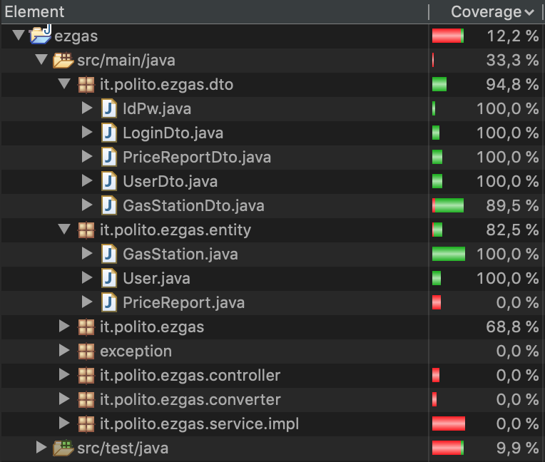

# Unit Testing Documentation

Authors: Giuliano Ettore, Koudounas Alkis, Pizzato Francesco

Date: 29/06/2020

Version: 3.0

List of changes

|             |                                      |
|-------------|--------------------------------------|
| Black Box   | Added test cases for Dto package     |
| White Box	  | Added test cases for Dto package     |
|	          | Updated Eclemma coverage screenshot  |
| Black Box   | Added test cases for PriceReportDto  |
| White Box	  | Corrected method names and implementations |
|	          | Updated Eclemma coverage screenshot  |

# Contents

- [Black Box Unit Tests](#black-box-unit-tests)

- [White Box Unit Tests](#white-box-unit-tests)

# Black Box Unit Tests

<!-- <Define here criteria, predicates and the combination of predicates for each function of each class.
    Define test cases to cover all equivalence classes and boundary conditions.
    In the table, report the description of the black box test case and (traceability) the correspondence with the JUnit test case writing the 
    class and method name that contains the test case>
    <JUnit test classes must be in src/test/java/it/polito/ezgas   You find here, and you can use,  class EZGasApplicationTests.java that is executed before 
    the set up of all Spring components> -->
    
In the following, we analyze all the combination of criteria and the boundary values of significant methods of each "leaf class" of our application. 
Many of the checks though are done in the serviceImpl package, therefore most of the limit cases can't be tested in this section, but will be the object of the integration testing.
Anyway, we decided to write the Junit tests related to these exceptions or boundary cases, and after having verified that they (obviously) failed, we commented them, in order to get a "cleaner" result. In the Java files of the ***it.polito.ezgas.unit*** package, each one of these tests can be found.

 <!-- when we will test these cases, we will report it in the appropriate section. We would like to underscore again that the Junit tests related to these exceptions or boundary cases will (obviously) fail during the run of the application. -->

We start here from the Entity package.

 ### **User.java** - **public void setUserId(Integer userId)**

**Predicates:**

| Criteria    | Predicate                            |
|-------------|--------------------------------------|
| Value       |   userId <= 0                        |
|	          |   userId > 0                         |
|	          |   userId = NULL                      |
| Range       | userId < MinINT                      |
|	          | userId > MaxINT                      |
|	          | userId >= MinINT && userId <= MaxINT |

**Boundaries**:

| Criteria    |Boundary values|
|-------------|---------------|
| Value       |       0       |
|             |       1       |
|             |      -1       |
|             |    NULL       |
| Range       |    MinINT     |
|             |    MinINT-1   |
|             |    MinINT+1   |
|             |    MaxINT     |
|             |    MaxINT+1   |
|             |    MaxINT-1   |

**Combination of predicates**:

| Criteria 1    | Criteria 2                        | Valid / Invalid | Description of the test case   | JUnit test case  |
|---------------|-----------------------------------|-----------------|--------------------------------|----------------- |
| userId <= 0   |           -                       |  I              | T1(-2) -> InvalidUserException | _`testUserId()`_ |
| userId > 0    | userId < MinINT                   | Not Feasible    |                                |                  |
| userId > 0    | userId > MaxINT                   |  I              | T2(MaxINT+1) -> Exception      |                  |
| userId > 0    | userId >= MinINT && userId <= MaxINT|  V            | T3(32) -> this.userId = 32     | _`testUserId()`_ |
| userId = NULL |           -                       |  I              | T4(NULL) -> Exception          | _`testUserId()`_ |

### **User.java** - **public void setReputation(Integer reputation)**

**Predicates:**

| Criteria    | Predicate                            |
|-------------|--------------------------------------|
| Value       |   reputation < -5                        |
|	          |   reputation > 5                         |
|	          |   -5 <= reputation <= 5                  |
|	          | reputation = NULL                        |
| Range       | reputation < MinINT                      |
|	          | reputation > MaxINT                      |
|	          | reputation >= MinINT && reputation <= MaxINT |

**Boundaries**:

| Criteria       | Boundary values     |
|----------------|---------------------|
| Value          | -6                  |
|                | -5                  |
|                | -4                  |
|                | 4                   |
|                | 5                   |
|                | 6                   |
|                | NULL                |
| Range          |    MinINT           |
|                |    MinINT-1         |
|                |    MinINT+1         |
|                |    MaxINT           |
|                |    MaxINT+1         |
|                |    MaxINT-1         |

**Combination of predicates**:

| Criteria 1               | Criteria 2                                | Valid / Invalid | Description of the test case   | JUnit test case          |
|--------------------------|-------------------------------------------|-----------------|--------------------------------|--------------------------|
| reputation < -5          |           -                               |  I              | T1(-6) -> Exception            |                          |
| reputation >  5          |           -                               |  I              | T2(6) -> Exception             | _`testUserReputation()`_ |
| -5 <= reputation <= 5    | reputation < MinINT                       | Not Feasible    |                                |                          |
| -5 <= reputation <= 5    | reputation > MaxINT                       | Not Feasible    |                                |                          |
| -5 <= reputation <= 5    | reputation >= MinINT && reputation <= MaxINT|  V            | T3(4) -> this.reputation = 4   | _`testUserReputation()`_ |
| NULL                     |           -                               |  I              | T4(NULL) -> Exception          | _`testUserReputation()`_ |

### **User.java** - **public void setUserName(String userName) & other setAttribute(String Value)**

**Predicates:**

| Criteria    | Predicate                           |
|-------------|-------------------------------------|
| Length      | userName.length <= String.MAX_VALUE |
|             | userName.length > String.MAX_VALUE  |
| Value       | userName = NULL                     |
|             | userName != NULL                    |

**Boundaries**:

| Criteria    | Boundary values     |
|-------------|---------------------|
| Length      | String.MAX_VALUE    |
|             | String.MAX_VALUE+1  |
|             | String.MAX_VALUE-1  |
|             | 0                   |
| Value       | NULL                |

**Combination of predicates**:

| Criteria 1             | Criteria 2                          | Valid / Invalid | Description of the test case         | JUnit test case       |
|------------------------|-------------------------------------|-----------------|--------------------------------------|-----------------------|
| userName = NULL        |             -                       |   I             | T1(NULL) -> Exception                | _`testUserName()`_    |
| userName != NULL       | userName.length <= String.MAX_VALUE |   V             | T2("Anne") -> this.userName = "Anne" | _`testUserName()`_    |
| userName != NULL       | userName.length > String.MAX_VALUE  |   I             | T3(string.MAX_VALUE+1) -> Exception  |                       |

### **User.java** - **public void setAdmin(Boolean admin)**

**Predicates:**

| Criteria    | Predicate     |
|-------------|---------------|
| Value       | True          |
|             | False         |
|             | NULL          |

**Boundaries**:

| Criteria    |Boundary values|
|-------------|---------------|
| Value       | True          |
|             | False         |
|             | NULL          |

**Combination of predicates**:

| Criteria 1    | Valid / Invalid | Description of the test case | JUnit test case          |
|---------------|-----------------|------------------------------|------------------------- |
| admin = True  | V               | T1(True) -> admin = True     | _`testUserAdminTrue()`_  |
| admin = False | V               | T2(False) -> admin = False   | _`testUserAdminFalse()`_ |
| admin = NULL  | I               | T3(NULL) -> Exception        | _`testUserAdminNull()`_  |

### **User.java** - **public User(String userName, String password, String email, Integer reputation)**

**Predicates:**

| Criteria        | Predicate                                    |
|-----------------|----------------------------------------------|
| String Length   | String.length <= String.MAX_VALUE            |
|                 | String.length > String.MAX_VALUE             |
| String Value    | String = NULL                                |
|                 | String != NULL                               |
| Integer Value   | reputation < -5                              |
|	              | reputation > 5                               |
|	              | -5 <= reputation <= 5                        |
|	              | reputation = NULL                            | 
| Integer Range   | reputation < MinINT                          |
|	              | reputation > MaxINT                          |
|	              | reputation >= MinINT && reputation <= MaxINT |

**Boundaries**:

| Criteria       | Boundary values     |
|----------------|---------------------|
| String Length  | String.MAX_VALUE    |
|                | String.MAX_VALUE+1  |
|                | String.MAX_VALUE-1  |
|                | 0                   |
| String Value   | NULL                |
| Integer Value  | -6                  |
|                | -5                  |
|                | -4                  |
|                | 4                   |
|                | 5                   |
|                | 6                   |
|                | NULL                |
| Integer Range  |    MinINT           |
|                |    MinINT-1         |
|                |    MinINT+1         |
|                |    MaxINT           |
|                |    MaxINT+1         |
|                |    MaxINT-1         |

**Combination of predicates**:

| Criteria 1              | Criteria 2     | Criteria 3                                   | Criteria 4                        | Valid / Invalid | Description of the test case                                               | JUnit test case       |
|-------------------------|----------------|----------------------------------------------|-----------------------------------|----------------|-----------------------------------------------------------------------------|-----------------------|
| reputation = NULL       |      -         |      -                                       |       -                           |      I         | T1(-, -, -, NULL) -> Exception                                              |                       |
| reputation < -5         |      -         |      -                                       |       -                           |      I         | T2(-, -, -, -8) -> Exception                                                |                       |
| reputation > 5          |      -         |      -                                       |       -                           |      I         | T3(-, -, -, 8) -> Exception                                                 |                       |
| -5 <= reputation <= 5   | String = NULL  |  -                                           |       -                           |      I         | T4(NULL, NULL, -, 2) -> Exception                                           |                       |
| -5 <= reputation <= 5   | String != NULL | reputation < MinINT                          |       -                           | Not Feasible   |                                                                             |                       |
| -5 <= reputation <= 5   | String != NULL | reputation > MaxINT                          |       -                           | Not Feasible   |                                                                             |                       |
| -5 <= reputation <= 5   | String != NULL | reputation >= MinINT && reputation <= MaxINT | String.length > String.MAX_VALUE  |      I         | T5(string.MAX_VALUE+1, -, -, 2) -> Exception                                |                       |
| -5 <= reputation <= 5   | String != NULL | reputation >= MinINT && reputation <= MaxINT | String.length <= String.MAX_VALUE |      V         | T6("Anne", "password", "anne@email.it", 4) -> this.userName = "Anne" && ... | _`testUserConstructor()`_ |

### **GasStation.java** - **public void setGasStationId(Integer gasStationId) & other setAttribute(Integer Value)**

**Predicates:**

| Criteria    | Predicate       |
|-------------|-----------------|
| Value       |   gasStationId <= 0   |
|	          |   gasStationId > 0    |
|	          |   gasStationId = NULL |
| Range       | gasStationId < MinINT |
|	          | gasStationId > MaxINT |
|	          | gasStationId >= MinINT && gasStationId <= MaxINT |

**Boundaries**:

| Criteria    |Boundary values|
|-------------|---------------|
| Value       |       0       |
|             |       1       |
|             |      -1       |
|             |    NULL       |
| Range       |    MinINT     |
|             |    MinINT-1   |
|             |    MinINT+1   |
|             |    MaxINT     |
|             |    MaxINT+1   |
|             |    MaxINT-1   |

**Combination of predicates**:

| Criteria 1          | Criteria 2                                       | Valid / Invalid | Description of the test case           | JUnit test case        |
|---------------------|--------------------------------------------------|-----------------|----------------------------------------|----------------------- |
| gasStationId = NULL |           -                                      |  I              | T1(NULL) -> Exception                  | _`testGasStationId()`_ |
| gasStationId <= 0   |           -                                      |  I              | T2(-2) -> InvalidGasStationException   | _`testGasStationId()`_ |
| gasStationId > 0    | gasStationId < MinINT                            | Not Feasible    |                                        |                        |
| gasStationId > 0    | gasStationId > MaxINT                            |  I              | T3(MaxINT+1) -> Exception              |                        |
| gasStationId > 0    | gasStationId >= MinINT && gasStationId <= MaxINT |  V              | T4(1) -> this.gasStationId = 1         | _`testGasStationId()`_ |

### **GasStation.java** - **public void setGasStationName(String gasStationName) & other setAttribute(String Value)**

**Predicates:**

| Criteria    | Predicate                                 |
|-------------|-------------------------------------------|
| Length      | gasStationName.length <= String.MAX_VALUE |
|             | gasStationName.length > String.MAX_VALUE  |
| Value       | gasStationName = NULL                     |
|             | gasStationName != NULL                    |

**Boundaries**:

| Criteria    | Boundary values     |
|-------------|---------------------|
| Length      | String.MAX_VALUE    |
|             | String.MAX_VALUE+1  |
|             | String.MAX_VALUE-1  |
|             | 0                   |
| Value       | NULL                |

**Combination of predicates**:

| Criteria 1             | Criteria 2                                | Valid / Invalid | Description of the test case                        | JUnit test case           |
|------------------------|-------------------------------------------|-----------------|-----------------------------------------------------|---------------------------|
| gasStationName = NULL  |             -                             |   I             | T1(NULL) -> Exception                               | _`testGasStationName()`_  |
| gasStationName != NULL | gasStationName.length <= String.MAX_VALUE |   V             | T2("Torino 1") -> this.gasStationName = "Torino 1"  | _`testGasStationName()`_  |
| gasStationName != NULL | gasStationName.length > String.MAX_VALUE  |   I             | T3(string.MAX_VALUE+1) -> Exception                 |                           |

### **GasStation.java** - **public void setHasDiesel(boolean hasDiesel) & other setHasGasolineType(boolean Value)**

**Predicates:**

| Criteria    | Predicate     |
|-------------|---------------|
| Value       | True          |
|             | False         |

**Boundaries**:

| Criteria    |Boundary values|
|-------------|---------------|
| Value       | True          |
|             | False         |

**Combination of predicates**:

| Criteria 1        | Valid / Invalid | Description of the test case   | JUnit test case           |
|-------------------|-----------------|--------------------------------|---------------------------|
| hasDiesel = True  | V               | T1(True) -> hasDiesel = True   | _`testHasDieselTrue()`_   |
| hasDiesel = False | V               | T2(False) -> hasDiesel = False | _`testHasDieselFalse()`_  |

### **GasStation.java** - **public void setLat(double lat)**

**Predicates:**

| Criteria    | Predicate        |
|-------------|------------------|
| Value       | < -90            |
|             | >= 90            |
|             | -90 <= lat < 90  |
| Range       | lat < MinDOUBLE  |
|	          | lat > MaxDOUBLE  |
|	          | lat >= MinDOUBLE && lat <= MaxDOUBLE |

**Boundaries**:

| Criteria    |Boundary values|
|-------------|---------------|
| Value       | -90           |
|             | -91           |
|	          | -89           |
|             | 90            |
|             | 91            |
|	          | 89            |
|  Range      | MinDOUBLE     |
|             | MinDOUBLE-1   |
|             | MinDOUBLE+1   |
|             | MaxDOUBLE     |
|             | MaxDOUBLE+1   |
|             | MaxDOUBLE-1   |

**Combination of predicates**:

| Criteria 1                           | Criteria 2       |  Valid / Invalid | Description of the test case          | JUnit test case    |
|--------------------------------------|------------------|------------------|---------------------------------------|--------------------|
| lat < MinDOUBLE                      |        -         | I                | T1(MinDOUBLE-1) -> Exception          |                    |
| lat > MaxDOUBLE                      |        -         | I                | T2(MaxDOUBLE+1) -> Exception          |                    |
| lat >= MinDOUBLE && lat <= MaxDOUBLE | lat < -90        | I                | T3(-200.078990) -> GPSDataException   | _`testLatitude()`_ |
| lat >= MinDOUBLE && lat <= MaxDOUBLE | lat >= 90        | I                | T4(200.098990) -> GPSDataException    | _`testLatitude()`_ |
| lat >= MinDOUBLE && lat <= MaxDOUBLE | -90 <= lat < 90  | V                | T5(45.066667) -> this.lat = 45.066667 | _`testLatitude()`_ |

### **GasStation.java** - **public void setLon(double lon)**

**Predicates:**

| Criteria    | Predicate         |
|-------------|-------------------|
| Value       | < -180            |
|             | >= 180            |
|             | -180 <= lon < 180 |
| Range       | lon < MinDOUBLE   |
|	          | lon > MaxDOUBLE   |
|	          | lon >= MinDOUBLE && lon <= MaxDOUBLE |

**Boundaries**:

| Criteria    |Boundary values|
|-------------|---------------|
| Value       | -180          |
|             | -181          |
|	          | -179          |
|             | 180           |
|             | 181           |
|	          | 179           |
|  Range      | MinDOUBLE     |
|             | MinDOUBLE-1   |
|             | MinDOUBLE+1   |
|             | MaxDOUBLE     |
|             | MaxDOUBLE+1   |
|             | MaxDOUBLE-1   |

**Combination of predicates**:

| Criteria 1                           | Criteria 2         |  Valid / Invalid | Description of the test case        | JUnit test case     |
|--------------------------------------|--------------------|------------------|-------------------------------------|---------------------|
| lon < MinDOUBLE                      |        -           | I                | T1(MinDOUBLE-1) -> Exception        |                     |
| lon > MaxDOUBLE                      |        -           | I                | T2(MaxDOUBLE+1) -> Exception        |                     |
| lon >= MinDOUBLE && lon <= MaxDOUBLE | lon < -180         | I                | T3(-200.07890) -> GPSDataException  | _`testLongitude()`_ |
| lon >= MinDOUBLE && lon <= MaxDOUBLE | lon >= 180         | I                | T4(200.09890) -> GPSDataException   | _`testLongitude()`_ |
| lon >= MinDOUBLE && lon <= MaxDOUBLE | -180 <= lon < 180  | V                | T5(7.666667) -> this.lon = 7.666667 | _`testLongitude()`_ |

### **GasStation.java** - **public void setDieselPrice(Double dieselPrice) & other setGasolineTypePrice(Double Value)**

**Predicates:**

| Criteria    | Predicate     |
|-------------|---------------|
| Value       | price <= 0    |
|             | price > 0     |
|             | price = NULL  |
| Range       | price < MinDOUBLE  |
|	          | price > MaxDOUBLE  |
|	          | price >= MinDOUBLE && price <= MaxDOUBLE |

**Boundaries**:

| Criteria    |Boundary values|
|-------------|---------------|
| Value       | 0             |
|             | 1             |
|             | -1            |
|             | NULL          |
|  Range      | MinDOUBLE     |
|             | MinDOUBLE-1   |
|             | MinDOUBLE+1   |
|             | MaxDOUBLE     |
|             | MaxDOUBLE+1   |
|             | MaxDOUBLE-1   |

**Combination of predicates**:

| Criteria 1                               | Criteria 2  | Valid / Invalid | Description of the test case         | JUnit test case        |
|------------------------------------------|-------------|-----------------|--------------------------------------|------------------------|
| price < MinDOUBLE                        | -           |  I              | T1(MinDOUBLE-1) -> Exception         |                        |
| price > MaxDOUBLE                        | -           |  I              | T2(MaxDOUBLE+1) -> Exception         |                        |
| price >= MinDOUBLE && price <= MaxDOUBLE | price <= 0  |  I              | T3(-0.5) -> PriceException           | _`testDieselPrice()`_  |
| price >= MinDOUBLE && price <= MaxDOUBLE | price > 0   |  V              | T4(1.37 ) -> this.dieselPrice = 1.37 | _`testDieselPrice()`_  |
| price >= MinDOUBLE && price <= MaxDOUBLE | price = NULL|  Not Feasible   |                                      |                        |

### **GasStation.java** - **public GasStation(String gasStationName, String gasStationAddress, boolean hasDiesel, boolean hasSuper, boolean hasSuperPlus, boolean hasGas, boolean hasMethane, String carSharing, double lat, double lon, Double dieselPrice, Double superPrice, Double superPlusPrice, Double gasPrice, Double methanePrice, Double premiumDieselPrice, Integer reportUser, String reportTimestamp, double reportDependability)**

**Predicates:**

| Criteria        | Predicate                               |
|-----------------|-----------------------------------------|
| String Length   | String.length <= String.MAX_VALUE    	|
|                 | String.length > String.MAX_VALUE     	|
| String Value    | String = NULL                        	|
|                 | String != NULL                       	|
| Integer Value   | reportUser <= 0                         |
|	              | reportUser > 0                          |
|	              | reportUser = NULL                   	| 
| Integer Range   | reportUser < MinINT                     |
|	              | reportUser > MaxINT                     |
|	              | reportUser >= MinINT && userId <= MaxINT|
| Price Value     | price <= 0                           	|
|                 | price > 0                            	|
|                 | price = NULL                            |
| Lon Value       | < -180                                	|
|                 | >= 180                                 	|
|                 | -180 <= lon < 180                       |
| Lat Value       | < -90                                 	|
|                 | >= 90                                  	|
|                 | -90 <= lat < 90                         |
| boolean Value   | True                                 	|
|                 | False                                	|
| double Range    | double < MinDOUBLE                      |
|	              | double > MaxDOUBLE                      |
|	              | double >= MinDOUBLE && double <= MaxDOUBLE |

**Boundaries**:

| Criteria        | Boundary values     |   
|-----------------|---------------------|
| String Length   | String.MAX_VALUE    |
|                 | String.MAX_VALUE+1  |
|                 | String.MAX_VALUE-1  |
| String Value    | NULL                |
| Integer Value   | 0                   |
|	              | -1                  |
|	              | 1                   |
|	              | NULL                |
| Integer Range   | MinINT              |
|	              | MinINT+1            |
|	              | MinINT-1            |
|	              | MaxINT              |
|	              | MaxINT+1            |
|	              | MaxINT-1            |
| Price Value     | 0                   |
|                 | -1                  |
|                 | 1                   |
|                 | NULL                |
| Lon Value       | -180                |
|                 | -181                |
|	              | -179                |
|                 | 180                 |
|                 | 181                 |
|	              | 179                 |
| Lat Value       | -90                 |
|                 | -91                 |
|	              | -89                 |
|                 | 90                  |
|                 | 91                  |
|	              | 89                  |
| boolean Value   | True                |
|                 | False               |
| double Range    | MinDOUBLE           |
|                 | MinDOUBLE-1         |
|                 | MinDOUBLE+1         |
|                 | MaxDOUBLE           |
|                 | MaxDOUBLE+1         |
|                 | MaxDOUBLE-1         |

**Combination of predicates**:

| Criteria 1        | Criteria 2     | Criteria 3                               | Criteria 4                        | Criteria 5   | Criteria 6                               | Criteria 7         | Criteria 8       | Criteria 9   | Valid / Invalid | Description of the test case                               | JUnit test case |
|-------------------|----------------|------------------------------------------|-----------------------------------|--------------|------------------------------------------|--------------------|------------------|--------------|-----------------|------------------------------------------------------------|-----------------|
| reportUser = NULL |      -         |     -                                    |       -                           |        -     |     -                                    |       -            |       -          |       -      |    I            | T1(..., NULL) -> Exception                                 |                 |
| reportUser <= 0   |      -         |     -                                    |       -                           |        -     |     -                                    |       -            |       -          |       -      |    I            | T2(..., -1) -> InvalidUserException                        |                 |
| reportUser > 0    | String = NULL  |   -                                      |       -                           |        -     |     -                                    |       -            |       -          |       -      |    I            | T3(..., NULL) -> Exception                                 |                 |
| reportUser > 0    | String != NULL | reportUser < MinINT                      | -                                 |        -     |     -                                    |       -            |       -          |       -      | Not Feasible    |                                                            |                 |
| reportUser > 0    | String != NULL | reportUser > MaxINT                      | -                                 |        -     |     -                                    |       -            |       -          |       -      |    I            | T5(..., MaxINT+1) -> Exception                             |                 |
| reportUser > 0    | String != NULL | reportUser >= MinINT && userId <= MaxINT | String.length > String.MAX_VALUE  | -            |     -                                    |       -            |       -          |       -      |    I            | T6(..., string.MAX_VALUE+1) -> Exception                   |                 |
| reportUser > 0    | String != NULL | reportUser >= MinINT && userId <= MaxINT | String.length <= String.MAX_VALUE | price <= 0   |     -                                    |       -            |       -          |       -      |    I            | T7(..., -0.8) -> PriceException                            |
| reportUser > 0    | String != NULL | reportUser >= MinINT && userId <= MaxINT | String.length <= String.MAX_VALUE | price = NULL |     -                                    |       -            |       -          |       -      | Not Feasible    |                                                            |                 |                 |
| reportUser > 0    | String != NULL | reportUser >= MinINT && userId <= MaxINT | String.length <= String.MAX_VALUE | price > 0    | value < MinDOUBLE                        |       -            |       -          |       -      | Not Feasible    |                                                            |                 |
| reportUser > 0    | String != NULL | reportUser >= MinINT && userId <= MaxINT | String.length <= String.MAX_VALUE | price > 0    | value > MaxDOUBLE                        |       -            |       -          |       -      |    I            | T8(..., maxDOUBLE+1) -> Exception                          |                 |
| reportUser > 0    | String != NULL | reportUser >= MinINT && userId <= MaxINT | String.length <= String.MAX_VALUE | price > 0    | value >= MinDOUBLE && value <= MaxDOUBLE | lon < -180         |       -          |       -      |    I            | T9(..., -200) -> GPSDataException                          |                  |
| reportUser > 0    | String != NULL | reportUser >= MinINT && userId <= MaxINT | String.length <= String.MAX_VALUE | price > 0    | value >= MinDOUBLE && value <= MaxDOUBLE | lon >= 180         |       -          |       -      |    I            | T10(..., 200) -> GPSDataException                          |                 |
| reportUser > 0    | String != NULL | reportUser >= MinINT && userId <= MaxINT | String.length <= String.MAX_VALUE | price > 0    | value >= MinDOUBLE && value <= MaxDOUBLE | -180 <= lon < 180  |   lat < -90      |       -      |    I            | T11(..., -100) -> GPSDataException                         |                 |
| reportUser > 0    | String != NULL | reportUser >= MinINT && userId <= MaxINT | String.length <= String.MAX_VALUE | price > 0    | value >= MinDOUBLE && value <= MaxDOUBLE | -180 <= lon < 180  |   lat >= 90      |       -      |    I            | T12(..., 100) -> GPSDataException                          |                 |
| reportUser > 0    | String != NULL | reportUser >= MinINT && userId <= MaxINT | String.length <= String.MAX_VALUE | price > 0    | value >= MinDOUBLE && value <= MaxDOUBLE | -180 <= lon < 180  | -90 <= lat < 90  |    True      |    V            | T13(..., true) -> this.GasStationName = "Torino 1" && ...  | _`testGasStationConstructor()`_  |
| reportUser > 0    | String != NULL | reportUser >= MinINT && userId <= MaxINT | String.length <= String.MAX_VALUE | price > 0    | value >= MinDOUBLE && value <= MaxDOUBLE | -180 <= lon < 180  | -90 <= lat < 90  |    False     |    V            | T14(..., false) -> this.GasStationName = "Torino 1" && ... | _`testGasStationConstructor()`_  |

In the following, we analyze the Dto package. Since the classes are very similar to the ones in the Entity package, we just remark here the examination of the constructors (the complete list of the tests is in the table in the ***White Box*** section).

### **UserDto.java** - **public UserDto (Integer userId, String userName, String password, String email, Integer reputation)**

**Predicates:**

| Criteria    | Predicate                            |
|-------------|--------------------------------------|
|String Length|   String.length <= String.MAX_VALUE  |
|	          |   String.length > String.MAX_VALUE   |
|String Value |   String = NULL                      |
|	          |   String != NULL                     |
| Reputation  |   Reputation < -5                    |
|             |   Reputation > 5		             |
|             |   -5 <= Reputation <= 5		         |
| UserId      |   UserId <= 0                        |
|             |   UserId > 0                         |
| Integer     |   Integer = NULL                     |
| 	          |   Integer != NULL                    |

**Boundaries**:

|Criteria     | Boundary Values |
|-------------|-----------------|
| String value| NULL            |
|String Length| String.MAX_VALUE|
|	          | String.MAX_VALUE+1|
|	          | String.MAX_VALUE-1|
| Reputation  | -5              |
|	          | -6              |
|	          | -4              |
|	          | 5               |
|	          | 6               |
|	          | 4               |
| UserId      | 0               |
|	          | 1               |
|	          | -1              | 
| Integer     | NULL            |
 
**Combination of predicates**:

| Criteria 1     | Criteria 2                 | Criteria 3            | Criteria 4     | Criteria 5      | Valid/Invalid | Description of the test case                                                 | JUnit test case               |
|----------------|----------------------------|-----------------------|----------------|-----------------|---------------|------------------------------------------------------------------------------|-------------------------------|
| String = NULL  |     -                      |     -                 |      -         |     -           |     I         | T1(-, -, -, NULL, -) -> Exception                                            |                               |
| String != NULL | String.length > MAX_VALUE  | -                     |      -         |     -           |     I         | T2(-, -, -, string.MAX_VALUE+1, -) -> Exception                              |                               |
| String != NULL | String.length <= MAX_VALUE | Reputation <-5        |      -         |     -           |     I         | T3(-, -, -, -, -7) -> Exception                                              |                               |
| String != NULL | String.length <= MAX_VALUE | Reputation > 5        |      -         |     -           |     I         | T4(-, -, -, -, 7) -> Exception                                               |                               |
| String != NULL | String.length <= MAX_VALUE | -5 <= Reputation <= 5 | UserId <= 0    |     -           |     I         | T5(-1, -, -, -, 2) -> InvalidUserException                                   |                               |
| String != NULL | String.length <= MAX_VALUE | -5 <= Reputation <= 5 | UserId > 0     | Integer = NULL  |  Not Feasible |                                                                              |                               |
| String != NULL | String.length <= MAX_VALUE | -5 <= Reputation <= 5 | UserId > 0     | Integer != NULL |     V         | T6(1, "Anne", "password", "anne@email.it", 4) -> this.userId = 1 && ...      | _`testUserConstructor1Dto()`_ |

### **UserDto.java** - **public UserDto(Integer userId, String userName, String password, String email, Integer reputation, Boolean admin)**

**Predicates:**

| Criteria    | Predicate                            |
|-------------|--------------------------------------|
|String Length|   String.length <= String.MAX_VALUE  |
|	          |   String.length > String.MAX_VALUE   |
|String Value |   String = NULL                      |
|	          |   String != NULL                     |
| Reputation  |   Reputation < -5                    |
|             |   Reputation > 5		             |
|             |   -5 <= Reputation <= 5		         |
| UserId      |   UserId <= 0                        |
|             |   UserId > 0                         |
| Integer     |   Integer = NULL                     |
| 	          |   Integer != NULL                    |
| Admin Value |  True                                |
| 	          |   False                              |
| 	          |   NULL                               |

**Boundaries**:

|Criteria     | Boundary Values |
|-------------|-----------------|
| String value| NULL            |
|String Length| String.MAX_VALUE|
|	          | String.MAX_VALUE+1|
|	          | String.MAX_VALUE-1|
| Reputation  | -5              |
|	          | -6              |
|	          | -4              |
|	          | 5               |
|	          | 6               |
|	          | 4               |
| UserId      | 0               |
|	          | 1               |
|	          | -1              | 
| Integer     | NULL            |
| Admin Value | True            |
|	          | False           |
|	          | NULL            |
 
**Combination of predicates**:

| Criteria 1     | Criteria 2                 | Criteria 3            | Criteria 4     | Criteria 5      | Criteria 6    | Valid/Invalid | Description of the test case                                                   | JUnit test case               |
|----------------|----------------------------|-----------------------|----------------|-----------------|---------------|---------------|--------------------------------------------------------------------------------|-------------------------------|
 String = NULL   |     -                      |     -                 |       -        |     -           |     -         |     I         | T1(-, -, -, NULL, -, -) -> Exception                                           |                               |
| String != NULL | String.length > MAX_VALUE  | -                     |       -        |     -           |     -         |     I         | T2(-, -, -, string.MAX_VALUE+1, -, -) -> Exception                             |                               |
| String != NULL | String.length <= MAX_VALUE | Reputation <-5        |       -        |     -           |     -         |     I         | T3(-, -, -, -, -7, -) -> Exception                                             |                               |
| String != NULL | String.length <= MAX_VALUE | Reputation > 5        |       -        |     -           |     -         |     I         | T4(-, -, -, -, 7, -) -> Exception                                              |                               |
| String != NULL | String.length <= MAX_VALUE | -5 <= Reputation <= 5 | UserId <= 0    |     -           |     -         |     I         | T5(-1, -, -, -, 2, -) -> InvalidUserException                                  |                               |
| String != NULL | String.length <= MAX_VALUE | -5 <= Reputation <= 5 | UserId > 0     | Integer = NULL  |     -         |  Not Feasible |                                                                                |                               |
| String != NULL | String.length <= MAX_VALUE | -5 <= Reputation <= 5 | UserId > 0     | Integer != NULL | Admin = False |     V         | T6(1, "Anne", "password", "anne@email.it", 4, false) -> this.userId = 1 && ... |                               |
| String != NULL | String.length <= MAX_VALUE | -5 <= Reputation <= 5 | UserId > 0     | Integer != NULL | Admin = True  |     V         | T7(2, "Anne", "password", "anne@email.it", 4, true) -> this.userId = 2 && ...  | _`testUserConstructor2Dto()`_ |
| String != NULL | String.length <= MAX_VALUE | -5 <= Reputation <= 5 | UserId > 0     | Integer != NULL | Admin = NULL  |     V         | T8(3, "Anne", "password", "anne@email.it", 4, null) -> this.userId = 3 && ...  |                               |

### **GasStationDto.java** - **public GasStationDto(Integer gasStationId, String gasStationName, String gasStationAddress, boolean hasDiesel, boolean hasSuper, boolean hasSuperPlus, boolean hasGas, boolean hasMethane, String carSharing, double lat, double lon, Double dieselPrice, Double superPrice, Double superPlusPrice, Double gasPrice, Double methanePrice, Double premiumDieselPrice, Integer reportUser, String reportTimestamp, double reportDependability)**

**Predicates:**

| Criteria        | Predicate                               |
|-----------------|-----------------------------------------|
| String Length   | String.length <= String.MAX_VALUE    	|
|                 | String.length > String.MAX_VALUE     	|
| String Value    | String = NULL                        	|
|                 | String != NULL                       	|
| Integer Value   | reportUser <= 0                         |
|	              | reportUser > 0                          |
|	              | reportUser = NULL                   	| 
| Integer Range   | reportUser < MinINT                     |
|	              | reportUser > MaxINT                     |
|	              | reportUser >= MinINT && userId <= MaxINT|
| Price/Id Value  | price <= 0                           	|
|                 | price > 0                            	|
|                 | price = NULL                            |
| Lon Value       | < -180                                	|
|                 | >= 180                                 	|
|                 | -180 <= lon < 180                       |
| Lat Value       | < -90                                 	|
|                 | >= 90                                  	|
|                 | -90 <= lat < 90                         |
| boolean Value   | True                                 	|
|                 | False                                	|
| double Range    | double < MinDOUBLE                      |
|	              | double > MaxDOUBLE                      |
|	              | double >= MinDOUBLE && double <= MaxDOUBLE |

**Boundaries**:

| Criteria        | Boundary values     |   
|-----------------|---------------------|
| String Length   | String.MAX_VALUE    |
|                 | String.MAX_VALUE+1  |
|                 | String.MAX_VALUE-1  |
| String Value    | NULL                |
| Integer Value   | 0                   |
|	              | -1                  |
|	              | 1                   |
|	              | NULL                |
| Integer Range   | MinINT              |
|	              | MinINT+1            |
|	              | MinINT-1            |
|	              | MaxINT              |
|	              | MaxINT+1            |
|	              | MaxINT-1            |
| Price/Id Value  | 0                   |
|                 | -1                  |
|                 | 1                   |
|                 | NULL                |
| Lon Value       | -180                |
|                 | -181                |
|	              | -179                |
|                 | 180                 |
|                 | 181                 |
|	              | 179                 |
| Lat Value       | -90                 |
|                 | -91                 |
|	              | -89                 |
|                 | 90                  |
|                 | 91                  |
|	              | 89                  |
| boolean Value   | True                |
|                 | False               |
| double Range    | MinDOUBLE           |
|                 | MinDOUBLE-1         |
|                 | MinDOUBLE+1         |
|                 | MaxDOUBLE           |
|                 | MaxDOUBLE+1         |
|                 | MaxDOUBLE-1         |

**Combination of predicates**:

| Criteria 1        | Criteria 2     | Criteria 3                               | Criteria 4                        | Criteria 5      | Criteria 6                               | Criteria 7         | Criteria 8       | Criteria 9   | Valid / Invalid | Description of the test case                               | JUnit test case |
|-------------------|----------------|------------------------------------------|-----------------------------------|-----------------|------------------------------------------|--------------------|------------------|--------------|-----------------|------------------------------------------------------------|-----------------|
| reportUser = NULL |      -         |     -                                    |       -                           |        -        |     -                                    |       -            |       -          |       -      |    I            | T1(..., NULL) -> Exception                                 |                 |
| reportUser <= 0   |      -         |     -                                    |       -                           |        -        |     -                                    |       -            |       -          |       -      |    I            | T2(..., -1) -> InvalidUserException                        |                 |
| reportUser > 0    | String = NULL  |   -                                      |       -                           |        -        |     -                                    |       -            |       -          |       -      |    I            | T3(..., NULL) -> Exception                                 |                 |
| reportUser > 0    | String != NULL | reportUser < MinINT                      | -                                 |        -        |     -                                    |       -            |       -          |       -      | Not Feasible    |                                                            |                 |
| reportUser > 0    | String != NULL | reportUser > MaxINT                      | -                                 |        -        |     -                                    |       -            |       -          |       -      |    I            | T5(..., MaxINT+1) -> Exception                             |                 |
| reportUser > 0    | String != NULL | reportUser >= MinINT && userId <= MaxINT | String.length > String.MAX_VALUE  | -               |     -                                    |       -            |       -          |       -      |    I            | T6(..., string.MAX_VALUE+1) -> Exception                   |                 |
| reportUser > 0    | String != NULL | reportUser >= MinINT && userId <= MaxINT | String.length <= String.MAX_VALUE | price/id <= 0   |     -                                    |       -            |       -          |       -      |    I            | T7(..., -0.8) -> PriceException/InvalidGasStationException |                 |
| reportUser > 0    | String != NULL | reportUser >= MinINT && userId <= MaxINT | String.length <= String.MAX_VALUE | price/id = NULL |     -                                    |       -            |       -          |       -      | Not Feasible    |                                                          |                 |
| reportUser > 0    | String != NULL | reportUser >= MinINT && userId <= MaxINT | String.length <= String.MAX_VALUE | price/id > 0    | value < MinDOUBLE                        |       -            |       -          |       -      | Not Feasible    |                                                          |                 |
| reportUser > 0    | String != NULL | reportUser >= MinINT && userId <= MaxINT | String.length <= String.MAX_VALUE | price/id > 0    | value > MaxDOUBLE                        |       -            |       -          |       -      |    I            | T8(..., maxDOUBLE+1) -> Exception                          |                 |
| reportUser > 0    | String != NULL | reportUser >= MinINT && userId <= MaxINT | String.length <= String.MAX_VALUE | price/id > 0    | value >= MinDOUBLE && value <= MaxDOUBLE | lon < -180         |       -          |       -      |    I            | T9(..., -200) -> GPSDataException                          |                  |
| reportUser > 0    | String != NULL | reportUser >= MinINT && userId <= MaxINT | String.length <= String.MAX_VALUE | price/id > 0    | value >= MinDOUBLE && value <= MaxDOUBLE | lon >= 180         |       -          |       -      |    I            | T10(..., 200) -> GPSDataException                          |                 |
| reportUser > 0    | String != NULL | reportUser >= MinINT && userId <= MaxINT | String.length <= String.MAX_VALUE | price/id > 0    | value >= MinDOUBLE && value <= MaxDOUBLE | -180 <= lon < 180  |   lat < -90      |       -      |    I            | T11(..., -100) -> GPSDataException                         |                 |
| reportUser > 0    | String != NULL | reportUser >= MinINT && userId <= MaxINT | String.length <= String.MAX_VALUE | price/id > 0    | value >= MinDOUBLE && value <= MaxDOUBLE | -180 <= lon < 180  |   lat >= 90      |       -      |    I            | T12(..., 100) -> GPSDataException                          |                 |
| reportUser > 0    | String != NULL | reportUser >= MinINT && userId <= MaxINT | String.length <= String.MAX_VALUE | price/id > 0    | value >= MinDOUBLE && value <= MaxDOUBLE | -180 <= lon < 180  | -90 <= lat < 90  |    True      |    V            | T13(..., true) -> this.GasStationName = "Torino 1" && ...  | _`testGasStationDtoConstructor()`_  |
| reportUser > 0    | String != NULL | reportUser >= MinINT && userId <= MaxINT | String.length <= String.MAX_VALUE | price/id > 0    | value >= MinDOUBLE && value <= MaxDOUBLE | -180 <= lon < 180  | -90 <= lat < 90  |    False     |    V            | T14(..., false) -> this.GasStationName = "Torino 1" && ... | _`testGasStationDtoConstructor()`_  |

### **IdPw.java** - **public void IdPw(String id, String pw)**

**Predicates:**

| Criteria    | Predicate                            |
|-------------|--------------------------------------|
|String Length|   String.length <= String.MAX_VALUE  |
|	          |   String.length > String.MAX_VALUE   |
|String Value |   String = NULL                      |
|	          |   String != NULL                     |

**Boundaries**:

| Criteria    |Boundary values      |
|-------------|---------------------|
|     Value   |    NULL             |
|     Length  | String.MAX_VALUE    |
|             | String.MAX_VALUE-1  |
|             | String.MAX_VALUE+1  |

**Combination of predicates**:

| Criteria 1    | Criteria 2      | Criteria 3                   | Criteria 4                    | Valid / Invalid | Description of the test case          | JUnit test case              |
|---------------|-----------------|------------------------------|-------------------------------|-----------------|---------------------------------------|------------------------------|
| id = NULL     |           -     |        -                     |         -                     |       I         | T1(null,"as") -> InvalidUserException |                              |
| id != NULL    | pw = NULL       |        -                     |         -                     |       I         | T2("as",null) -> InvalidUserException |                              |
| "             | pw! = NULL      |id.length > String.MAX_VALUE  |       -                       |       I         | T3(MAX_VALUE+1,"as") -> Exception     |                              |
| "             | "               |id.length <= String.MAX_VALUE | pw.length > String.MAX_VALUE  |       I         | T4("as",MAX_VALUE+1) -> Exception     |                              |
| "             | "               | "                            | pw.length <= String.MAX_VALUE |       V         | T5("as","df") -> id = as; pw = df     | _`testIdPwConstructorDto()`_ |

### **LoginDto.java** - **public LoginDto (Integer userId, String userName, String token, String email, Integer reputation)**

**Predicates:**

| Criteria    | Predicate                            |
|-------------|--------------------------------------|
|String Length|   String.length <= String.MAX_VALUE  |
|	          |   String.length > String.MAX_VALUE   |
|String Value |   String = NULL                      |
|	          |   String != NULL                     |
| Reputation  |   Reputation < -5                    |
|             |   Reputation > 5		             |
|             |   -5 <= Reputation <= 5		         |
| Id          |   Id <= 0                            |
|             |   Id > 0                             |
| Integer     |   Integer = NULL                     |
| 	          |   Integer != NULL                    |

**Boundaries**:

|Criteria     | Boundary Values |
|-------------|-----------------|
| String value| NULL            |
|String Length| String.MAX_VALUE|
|	          | String.MAX_VALUE+1|
|	          | String.MAX_VALUE-1|
| Reputation  | -5              |
|	          | -6              |
|	          | -4              |
|	          | 5               |
|	          | 6               |
|	          | 4               |
| Id          | 0               |
|	          | 1               |
|	          | -1              | 
| Integer     | NULL            |
 
**Combination of predicates**:

| Criteria 1     | Criteria 2                 | Criteria 3            | Criteria 4 | Criteria 5      | Valid/Invalid | Description of the test case                                                 | JUnit test case               |
|----------------|----------------------------|-----------------------|------------|-----------------|---------------|------------------------------------------------------------------------------|-------------------------------|
| String = NULL  |     -                      |     -                 |     -      |     -           |     I         | T1(-, -, -, NULL, -) -> Exception                                            |                               |
| String != NULL | String.length > MAX_VALUE  | -                     |   -        |     -           |     I         | T2(-, -, -, string.MAX_VALUE+1, -) -> Exception                              |                               |
| String != NULL | String.length <= MAX_VALUE | Reputation <-5        | -          |     -           |     I         | T3(-, -, -, -, -7) -> Exception                                              |                               |
| String != NULL | String.length <= MAX_VALUE | Reputation > 5        |     -      |     -           |     I         | T4(-, -, -, -, 7) -> Exception                                               |                               |
| String != NULL | String.length <= MAX_VALUE | -5 <= Reputation <= 5 | Id <= 0    |     -           |     I         | T5(-1, -, -, -, 2) -> InvalidUserException                                   |                               |
| String != NULL | String.length <= MAX_VALUE | -5 <= Reputation <= 5 | Id > 0     | Integer = NULL  |  Not Feasible |                                                                              |                               |
| String != NULL | String.length <= MAX_VALUE | -5 <= Reputation <= 5 | Id > 0     | Integer != NULL |     V         | T6(1, "Anne", "token", "anne@email.it", 4) -> this.userId = 1 && ...         | _`testLoginConstructorDto()`_ |

For the PriceReportDto class, we analyze only the constructor again, since other tests are similar to the ones already implemented in GasStation class (see above). Again, the complete list of the tests is in the table in the ***White Box*** section.

### **PriceReportDto.java** - **public PriceReportDto(Integer gasStationId, Double dieselPrice, Double superPrice, Double superPlusPrice, Double gasPrice, Double methanePrice, Double premiumDieselPrice, Double premiumDieselPrice, Integer userId)**

**Predicates:**

| Criteria        | Predicate                               |
|-----------------|-----------------------------------------|
| Integer Value   | id <= 0                                 |
|	              | id > 0                                  |
|	              | id = NULL                   	        | 
| Integer Range   | id < MinINT                             |
|	              | id > MaxINT                             |
|	              | id >= MinINT && userId <= MaxINT        |
| Double Value    | price <= 0                           	|
|                 | price > 0                            	|
|                 | NULL                                	|
| Double Range    | price < MinDOUBLE                       |
|	              | price > MaxDOUBLE                       |
|	              | price >= MinDOUBLE && price <= MaxDOUBLE|

**Boundaries**:

| Criteria        | Boundary values     |   
|-----------------|---------------------|
| Integer Value   | 0                   |
|	              | -1                  |
|	              | 1                   |
|	              | NULL                |
| Integer Range   | MinINT              |
|	              | MinINT+1            |
|	              | MinINT-1            |
|	              | MaxINT              |
|	              | MaxINT+1            |
|	              | MaxINT-1            |
| Double Value    | 0                   |
|                 | -1                  |
|                 | 1                   |
|                 | NULL                |
| Double Range    | MinDOUBLE           |
|                 | MinDOUBLE-1         |
|                 | MinDOUBLE+1         |
|                 | MaxDOUBLE           |
|                 | MaxDOUBLE+1         |
|                 | MaxDOUBLE-1         |

**Combination of predicates**:

| Criteria 1            | Criteria 2                 | Criteria 3                    | Criteria 4             | Valid/Invalid | Description of the test case                      | JUnit test case                                                |
|-----------------------|----------------------------|-------------------------------|------------------------|---------------|---------------------------------------------------|----------------------------------------------------------------|
| Id < MinINT           |              -             |          -                    |         -              |      I        | T1(MinINT-1,-,-,-,-,-,-,-) -> InvalidGasStationException / T2(-,-,-,-,-,-,-,MinINT-1) -> InvalidUserException  |   |
| Id > MaxINT           |              -             |          -                    |         -              |      I        | T3(MaxINT+1,-,-,-,-,-,-,-) -> InvalidGasStationException / T4(-,-,-,-,-,-,-,MaxINT+1) -> InvalidUserException  |   |
|MinINT <= Id <= MaxINT |         Id = NULL          |          -                    |         -              | Not Feasible  |                                                   |                                                                |
|MinINT <= Id <= MaxINT |         Id <= 0            |          -                    |         -              |      I        | T5(-2,-,-,-,-,-,-,-) -> InvalidGasStationException / T6(-,-,-,-,-,-,-,2) -> InvalidUserException               |   |
|MinINT <= Id <= MaxINT |         Id > 0             |   Price < MinDOUBLE           |         -              |      I        | T7(1,MinDOUBLE-1,-,-,-,-,-,1) -> PriceException   |                                                                |
|MinINT <= Id <= MaxINT |         Id > 0             |   Price > MaxDOUBLE           |         -              |      I        | T8(1,MaxDOUBLE+1,-,-,-,-,-,1) -> PriceException   |                                                                |
|MinINT <= Id <= MaxINT |         Id > 0             |MinDOUBLE <= Price <= MaxDOUBLE|     Price = NULL       |  Not Feasible |                                                   |                                                                |
|MinINT <= Id <= MaxINT |         Id > 0             |MinDOUBLE <= Price <= MaxDOUBLE|     Price <= 0         |      I        | T9(1,-1,-,-,-,-,-,1) -> PriceException            |                                                                |
|MinINT <= Id <= MaxINT |         Id > 0             |MinDOUBLE <= Price <= MaxDOUBLE|     Price > 0          |      V        | T10(1,1.42,1.57,1.70,0.97,0.99,1.50,1) -> this.gasStationId == 1 && ... |   _`testPriceReportDtoConstructor()`_    |

Finally, we analyze the Repository pakcage.

### **GasStationRepository.java** - **List<GasStation> findByProximity(double latitude, double longitude)**

**Predicates**:

| Criteria    | Predicate           |
|-------------|---------------------|
| lon         | < -180              |
|             | >= 180              |
|             | -180 <=lon < 180    |
| lat         | < -90               |
|             | >= 90               |
|             | -90 <= lat < 90     |
| Range       | value < MinDOUBLE   |
|	          | value > MaxDOUBLE   |
|	          | value >= MinDOUBLE && value <= MaxDOUBLE |

**Boundaries**:

| Criteria    |Boundary values|
|-------------|---------------|
| lon         | -180          |
|             | -181          |
|	          | -179          |
|             | 180           |
|             | 181           |
|	          | 179           |
| lat         | -90           |
|             | -91           |
|	          | -89           |
|             | 90            |
|             | 91            |
|	          | 89            |
|  Range      | MinDOUBLE     |
|             | MinDOUBLE-1   |
|             | MinDOUBLE+1   |
|             | MaxDOUBLE     |
|             | MaxDOUBLE+1   |
|             | MaxDOUBLE-1   |

**Combination of predicates**:

| Criteria 1                               | Criteria 2       | Criteria 3          | Valid / Invalid | Description of the test case                     | JUnit test case           |
|------------------------------------------|------------------|---------------------|-----------------|--------------------------------------------------|---------------------------|
| value < MinDOUBLE                        | -                |      -              |  I              |  T1(MinDOUBLE-1, ...) -> Exception               |                           |
| value > MaxDOUBLE                        | -                |      -              |  I              |  T2(MaxDOUBLE+1, ...) -> Exception               |                           |
| value >= MinDOUBLE && value <= MaxDOUBLE | lon < -180       |      -              |  I              |  T3(-908.098701,0,1) -> GPSDataException         | _`testFindByProximity()`_ |
| value >= MinDOUBLE && value <= MaxDOUBLE | lon >= 180       |      -              |  I              |  T4(1232.099124,0,1) -> GPSDataException         | _`testFindByProximity()`_ |
| value >= MinDOUBLE && value <= MaxDOUBLE | -180 <= lon < 180 | lat < -90          |  I              |  T5(0,-708.098701,1) -> GPSDataException         | _`testFindByProximity()`_ |
| value >= MinDOUBLE && value <= MaxDOUBLE | -180 <= lon < 180 | lat >= 90          |  I              |  T6(0,1239.099124,1) -> GPSDataException         | _`testFindByProximity()`_ |
| value >= MinDOUBLE && value <= MaxDOUBLE | -180 <= lon < 180 | -90 <= lat < 90    |  V              |  T7(45.066667,7.666667,1) -> return List<>       | _`testFindByProximity()`_ |
| value >= MinDOUBLE && value <= MaxDOUBLE | -180 <= lon < 180 | -90 <= lat < 90    |  V              |  T8(45.066667,7.666667,1) -> return EmptyList<>  | _`testFindByProximity()`_ |

### **GasStationRepository.java** - **List <GasStation> findByCarSharing(String carSharing)**

**Predicates:**

| Criteria    | Predicate                             |
|-------------|---------------------------------------|
| Length      | carSharing.length <= String.MAX_VALUE |
|             | carSharing.length > String.MAX_VALUE  |
| Value       | carSharing = NULL                     |
|             | carSharing = "Enjoy"                  |
|             | carSharing = "Car2Go"                 |
|             | carSharing !="Enjoy" && carSharing != "Car2Go" |

**Boundaries**:

| Criteria    | Boundary values     |
|-------------|---------------------|
| Length      | String.MAX_VALUE    |
|             | String.MAX_VALUE+1  |
|             | String.MAX_VALUE-1  |
|             | 0                   |
| Value       | NULL                |

**Combination of predicates**:

| Criteria 1                            | Criteria 2                                     | Valid / Invalid | Description of the test case               | JUnit test case                        |
|---------------------------------------|------------------------------------------------|-----------------|--------------------------------------------|----------------------------------------|
| carSharing.length > String.MAX_VALUE  |                  -                             |   I             | T1(string.MAX_VALUE+1) -> Exception        |                                        |
| carSharing.length <= String.MAX_VALUE | carSharing = NULL                              |   I             | T2(NULL) -> Exception                      |                                        |
| carSharing.length <= String.MAX_VALUE | carSharing = "Enjoy"                           |   V             | T3("Enjoy") -> return List<>               | _`testFindByCarSharing()`_             |
| carSharing.length <= String.MAX_VALUE | carSharing = "Car2Go"                          |   V             | T4("Car2Go") -> return List<>              | _`testFindByCarSharing()`_             |
| carSharing.length <= String.MAX_VALUE | carSharing !="Enjoy" && carSharing != "Car2Go" |   I             | T5("ToBike") -> InvalidCarSharingException | _`testFindByCarSharing()`_             |

### **UserRepository.java** - **User findByPasswordAndEmail(String pw, String user)**

**Predicates:**

| Criteria    | Predicate                      |
|-------------|--------------------------------|
| pw length   | pw.length <= String.MAX_VALUE  |
|             | pw.length > String.MAX_VALUE   |
| pw value    | pw = NULL                      |
|             | pw != NULL                     |
| user length | user.length <= String.MAX_VALUE|
|	          | user.length > String.MAX_VALUE |
| user value  | user = NULL                    |
|             | user != NULL                   |

**Boundaries**:

| Criteria    | Boundary values     |
|-------------|---------------------|
| pw length   | String.MAX_VALUE    |
|             | String.MAX_VALUE+1  |
|             | String.MAX_VALUE-1  |
|             | 0                   |
| pw value    | NULL                |
| user length | String.MAX_VALUE    |
|             | String.MAX_VALUE+1  |
|             | String.MAX_VALUE-1  |
|             | 0                   |
| user value  | NULL                |

**Combination of predicates**:

| Criteria 1                    | Criteria 2     | Criteria 3                      | Criteria 4   |  Valid / Invalid | Description of the test case                                            | JUnit test case |
|-------------------------------|----------------|---------------------------------|--------------|------------------|-------------------------------------------------------------------------|-----------------|
| pw.length > String.MAX_VALUE  |       -        |      -                          |      -       |  I               | T1(string.MAX_VALUE+1, ...) -> Exception                                |                 |
| pw.length <= String.MAX_VALUE |   pw = NULL    |      -                          |      -       |  I               | T2(NULL, ...) -> Exception                                              |                 |
| pw.length <= String.MAX_VALUE |   pw != NULL   | user.length > String.MAX_VALUE  |      -       |  I               | T3(..., string.MAX_VALUE+1) -> Exception                                |                 |
| pw.length <= String.MAX_VALUE |   pw != NULL   | user.length <= String.MAX_VALUE | user = NULL  |  I               | T4(..., NULL) -> Exception                                              |                 |
| pw.length <= String.MAX_VALUE |   pw != NULL   | user.length <= String.MAX_VALUE | user != NULL |  V               | T5("password", "mario@ezgas.com") -> User.password = "password" && ...  | _`testFindByPasswordAndEmail()`_ |

### **UserRepository.java** - **User findByEmail(String email)**

**Predicates:**

| Criteria     | Predicate                         |
|--------------|-----------------------------------|
| email length | email.length <= String.MAX_VALUE  |
|              | email.length > String.MAX_VALUE   |
| email value  | email = NULL                      |
|              | email != NULL                     |

**Boundaries**:

| Criteria     | Boundary values     |
|------------- |---------------------|
| email length | String.MAX_VALUE    |
|              | String.MAX_VALUE+1  |
|              | String.MAX_VALUE-1  |
|              | 0                   |
| email value  | NULL                |

**Combination of predicates**:
 
| Criteria 1          | Criteria 2                       | Valid / Invalid | Description of the test case                           | JUnit test case |
|---------------------|----------------------------------|-----------------|--------------------------------------------------------|-----------------|
| email = NULL        |        -                         |   I             | T1(NULL) -> Exception                                  |                 |
| email != NULL       | email.length > String.MAX_VALUE  |   I             | T2(string.MAX_VALUE+1) -> Exception                    |                 |
| email != NULL       | email.length <= String.MAX_VALUE |   V             | T3("mario@ezgas.com")-> User.email = "mario@ezgas.com" | _`testFindByEmail()`_ |

# White Box Unit Tests

### Test cases definition
    
<!-- <JUnit test classes must be in src/test/java/it/polito/ezgas>
    <Report here all the created JUnit test cases, and the units/classes under test >
    <For traceability write the class and method name that contains the test case> -->

| Package               | Unit name             | JUnit test case                                          |
|-----------------------|-----------------------|----------------------------------------------------------|
| ENTITY                | User                  | _`testUserId()`_                                         |
|                       | User                  | _`testUserName()`_                                       |
|                       | User                  | _`testUserEmail()`_                                      |
|                       | User                  | _`testUserPassword()`_                                   |
|                       | User                  | _`testUserAdminTrue()`_                                  |
|                       | User                  | _`testUserAdminFalse()`_                                 |
|                       | User                  | _`testUserReputation()`_                                 |
|                       | User                  | _`testUserConstructor()`_                                |
|                       | GasStation            | _`testGasStationId()`_                                   |
|                       | GasStation            | _`testGasStationName()`_                                 |
|                       | GasStation            | _`testHasDieselTrue()`_                                  |
|                       | GasStation            | _`testHasDieselFalse()`_                                 |
|                       | GasStation            | _`testHasPremiumDiesel()`_                               |
|                       | GasStation            | _`testLatitude()`_                                       |
|                       | GasStation            | _`testLongitude()`_                                      |
|                       | GasStation            | _`testDieselPrice()`_                                    |
|                       | GasStation            | _`testPremiumDieselPrice()`_                             |
|                       | GasStation            | _`testUser()`_                                           |
|                       | GasStation            | _`testReportUser()`_                                     |
|                       | GasStation            | _`testReportDependability()`_                            |
|                       | GasStation            | _`testReportTimeStamp()`_                                |
|                       | GasStation            | _`testGasStationAddress()`_                              |
|                       | GasStation            | _`testGasStationConstructor()`_                          | 
| DTO                   | UserDTO               | _`testUserIdDto()`_                                      |
|                       | UserDTO               | _`testUserNameDto()`_                                    |
|                       | UserDTO               | _`testUserEmailDto()`_                                   |
|                       | UserDTO               | _`testUserPasswordDto()`_                                |
|                       | UserDTO               | _`testUserAdminDto()`_                                   |
|                       | UserDTO               | _`testUserReputationDto()`_                              |
|                       | UserDTO               | _`testUserConstructor1Dto()`_                            |
|                       | UserDTO               | _`testUserConstructor2Dto()`_                            |
|                       | GasStationDTO         | _`testGasStationIdDto()`_                                |
|                       | GasStationDTO         | _`testGasStationNameDto()`_                              |
|                       | GasStationDTO         | _`testGasStationAddressDto()`_                           |
|                       | GasStationDTO         | _`testHasDieselDto()`_                                   |
|                       | GasStationDTO         | _`testHasGasDto()`_                                      |
|                       | GasStationDTO         | _`testHasSuperDto()`_                                    |
|                       | GasStationDTO         | _`testHasSuperPlusDto()`_                                |
|                       | GasStationDTO         | _`testHasMethaneDto()`_                                  |
|                       | GasStationDTO         | _`testHasPremiumDieselDto()`_                            |
|                       | GasStationDTO         | _`testCarSharingDto()`_                                  |
|                       | GasStationDTO         | _`testLatitudeDto()`_                                    |
|                       | GasStationDTO         | _`testLongitudeDto()`_                                   |
|                       | GasStationDTO         | _`testDieselPriceDto()`_                                 |
|                       | GasStationDTO         | _`testSuperPriceDto()`_                                  |
|                       | GasStationDTO         | _`testSuperPlusPriceDto()`_                              |
|                       | GasStationDTO         | _`testGasPriceDto()`_                                    |
|                       | GasStationDTO         | _`testMethanePriceDto()`_                                |
|                       | GasStationDTO         | _`testPremiumDieselPriceDto()`_                          |
|                       | GasStationDTO         | _`testUserDto()`_                                        |
|                       | GasStationDTO         | _`testReportUserDto()`_                                  |
|                       | GasStationDTO         | _`testReportDependability()`_                            |
|                       | GasStationDTO         | _`testReportTimeStamp()`_                                |
|                       | GasStationDTO         | _`testGasStationDtoConstructor()`_                       |
|                       | IdPw                  | _`testIdPwUserDto()`_                                    |
|                       | IdPw                  | _`testIdPwPasswordDto()`_                                |
|                       | IdPw                  | _`testIdPwConstructorDto()`_                             |
|                       | LoginDTO              | _`testLoginIdDto()`_                                     |
|                       | LoginDTO              | _`testLoginUserNameDto()`_                               |
|                       | LoginDTO              | _`testLoginEmailDto()`_                                  |
|                       | LoginDTO              | _`testLoginTokenDto()`_                                  |
|                       | LoginDTO              | _`testLoginAdminDto()`_                                  |
|                       | LoginDTO              | _`testLoginReputationDto()`_                             |
|                       | LoginDTO              | _`testLoginConstructorDto()`_                            |
|                       | PriceReportDTO        | _`testGasStationIdPriceReportDto()`_                     |
|                       | PriceReportDTO        | _`testDieselPriceReportDto()`_                           |
|                       | PriceReportDTO        | _`testSuperPriceReportDto()`_                            |
|                       | PriceReportDTO        | _`testSuperPlusPriceReportDto()`_                        |
|                       | PriceReportDTO        | _`testGasPriceReportDto()`_                              |
|                       | PriceReportDTO        | _`testMethanePriceReportDto()`_                          |
|                       | PriceReportDTO        | _`testPremiumDieselPriceReportDto()`_                    |
|                       | PriceReportDTO        | _`testUserIdPriceReportDto()`_                           |
|                       | PriceReportDTO        | _`testPriceReportDtoConstructor()`_                      |                    
| REPOSITORY            | UserRepository        | _`testFindByEmail()`_                                    |
|                       | UserRepository        | _`testFindByPasswordAndEmail()`_                         |
|                       | GasStationRepository  | _`testFindByHasDieselTrueOrderedByDieselPrice()`_        |
|                       | GasStationRepository  | _`testFindByHasGasTrueOrderedByGasPrice()`_              |
|                       | GasStationRepository  | _`testFindByHasSuperTrueOrderedBySuperPrice()`_          |
|                       | GasStationRepository  | _`testFindByHasSuperPlusTrueOrderedBySuperPlusPrice()`_  |
|                       | GasStationRepository  | _`testFindByHasMethaneTrueOrderedByMethanePrice()`_      |
|                       | GasStationRepository  | _`testFindByHasPremiumDieselTrueOrderByPremiumDieselPrice()`_ |
|                       | GasStationRepository  | _`testFindByProximity()`_                                |
|                       | GasStationRepository  | _`testFindByCarSharing`_                                 |

### Code coverage report

<!-- <Add here the screenshot report of the statement and branch coverage obtained using
    the Eclemma tool. > -->
    

As we can see from the screenshot above, the Entity and the Dto packages are covered from our tests (without considering, as specified, the PriceReport class).

### Loop coverage analysis

<!--    <Identify significant loops in the units and reports the test cases
    developed to cover zero, one or multiple iterations >

|Unit name | Loop rows | Number of iterations | JUnit test case |
|---|---|---|---|
|||||
|||||
||||||
-->

We don't have loops in this section of the code, so no further analysis is needed here.

